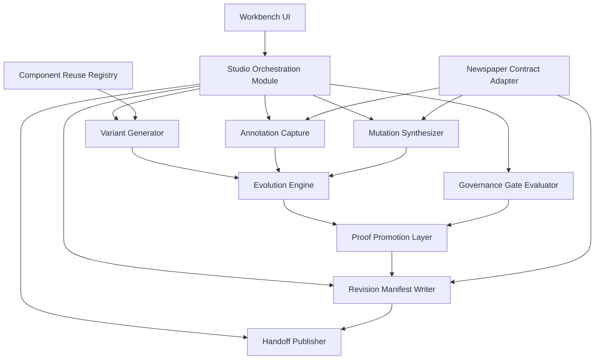
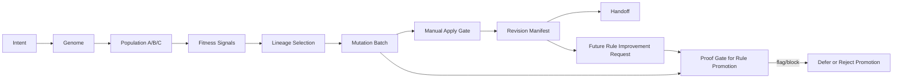

# UI Prototyping Studio Architecture

This architecture bundle follows the Arcanum `invoke design` six-view contract for the UI Prototyping Studio Evolution Engine.

Use this file as the system-level architecture summary. Use [EVOLUTION-ARCHITECTURE.md](EVOLUTION-ARCHITECTURE.md) for the detailed internals of the evolution loop, baseline genealogy, proof gates, and self-improvement layering.

## Source Contracts

| Source                                                 | Role                                                             |
| ------------------------------------------------------ | ---------------------------------------------------------------- |
| [PRODUCT-VIEW.md](PRODUCT-VIEW.md)                     | Conceptual product and capability view                           |
| [SPEC.md](SPEC.md)                                     | DomainSpec capability registry and FR/AC contract                |
| [domain.md](domain.md)                                 | Entities, value objects, enums, genetic/proof concepts           |
| [operations.md](operations.md)                         | Mutation, fitness, proof, and handoff operations                 |
| [workflows.md](workflows.md)                           | MVP workflow plus compatibility-named evolution workflow         |
| [states.md](states.md)                                 | Session and evolution-cycle state machines                       |
| [EVOLUTION-ARCHITECTURE.md](EVOLUTION-ARCHITECTURE.md) | Detailed evolution, genealogy, proof, and promotion architecture |
| [UI-SPEC.md](UI-SPEC.md)                               | Frontend route and panel contract                                |
| [TEST-SPEC.md](TEST-SPEC.md)                           | Verification obligations                                         |

## 1. Context View

UI Prototyping Studio sits between product ideation and formal UI implementation.

The feature receives interface intent, generates bounded Explore/Exploit prototype populations, captures qualitative selection evidence, applies approved mutations, and exports evidence into the DomainSpec UI delivery pipeline. It is not a general autonomous design agent; it is a governed evolution workbench where each durable change must be explainable through state, gate, task, revision, or proof evidence.

### Actors

| Actor             | Responsibility                                                      |
| ----------------- | ------------------------------------------------------------------- |
| Designer          | Provides prompt intent, compares variants, selects baseline lineage |
| Reviewer          | Captures element-level comments and qualitative fitness signals     |
| PM / Lead         | Reviews synthesized mutation batches and approves apply             |
| Engineer          | Consumes revision lineage and handoff artifacts                     |
| Governance System | Enforces proof obligations and blocks unsafe self-improvement       |

### Environmental Constraints

| Constraint                                 | Architectural Effect                                          |
| ------------------------------------------ | ------------------------------------------------------------- |
| `variantCount` bounded to `1..3`           | Population size is deliberately small and comparable          |
| Manual gates remain mandatory              | Auto-apply and auto-promotion are forbidden                   |
| HTML-first MVP output                      | Prototype phenotype is auditable and portable                 |
| DomainSpec aspect docs are source of truth | Architecture concepts must link to formal aspects             |
| Arcanum layering governs implementation    | Evolution/proof capabilities promote only with layer evidence |

## 2. High-Level Structure View

### Primary Subsystems

| Subsystem                    | Owns                                                                                                      |
| ---------------------------- | --------------------------------------------------------------------------------------------------------- |
| Workbench UI                 | Route, panels, forms, state indicators, disabled/enabled gate feedback                                    |
| Studio Orchestration Module  | Operation sequencing, session state, API boundary coordination                                            |
| Evolution Engine             | Genome, population, fitness evidence, selected genealogy family, identity/DNA evidence, mutation proposal |
| Proof Promotion Layer        | Proof obligations, pass/flag/block evaluation, self-improvement deferral                                  |
| Revision Manifest Writer     | Append-only lineage evidence and revision head update                                                     |
| DomainSpec Handoff Publisher | Story/spec/UI/test/implementation references                                                              |

## 3. Low-Level Components View

| Component                     | DomainSpec Concept                                  | Implementation Responsibility                                                               |
| ----------------------------- | --------------------------------------------------- | ------------------------------------------------------------------------------------------- |
| `StudioWorkbenchLayout`       | `ui-prototyping-studio.StudioWorkbenchPage`         | Composes visible product surface                                                            |
| `SessionControlsPanel`        | `ui-prototyping-studio.SessionControlsPanel`        | Captures prompt and bounded variant count                                                   |
| `VariantCanvas`               | `ui-prototyping-studio.VariantCanvas`               | Displays Explore/Exploit candidates and baseline controls                                   |
| `IdentityEvidencePanel`       | `ui-prototyping-studio.IdentityEvidencePanel`       | Confirms UI identity and visual DNA evidence                                                |
| `AnnotationPanel`             | `ui-prototyping-studio.AnnotationPanel`             | Captures element-level comment events                                                       |
| `MutationApprovalPanel`       | `ui-prototyping-studio.MutationApprovalPanel`       | Reviews draft mutations and enforces manual approval                                        |
| `RevisionTimeline`            | `ui-prototyping-studio.RevisionTimeline`            | Displays lineage evidence                                                                   |
| `HandoffSummaryPanel`         | `ui-prototyping-studio.HandoffSummaryPanel`         | Publishes downstream readiness                                                              |
| `GodelDarwinEvolutionAdapter` | `ui-prototyping-studio.GodelDarwinEvolutionAdapter` | Encodes genome, records baseline family, records fitness, evaluates proof, defers promotion |

## 4. Workflow Process View

The MVP uses the existing studio iteration loop to prove accountable Explore/Exploit evolution: bounded population, baseline selection, identity/DNA confirmation, mutation, and lineage. The proof layer blocks self-improvement until future implementation layers supply proof pass and governance approval; it does not block normal MVP apply.

## Evolution Engine

The full engine internals are specified in [EVOLUTION-ARCHITECTURE.md](EVOLUTION-ARCHITECTURE.md#evolution-engine). This summary architecture owns the subsystem boundaries; the detailed evolution architecture owns layer-specific runtime obligations. Existing formal IDs may retain `GodelDarwin` or `GodelProof` compatibility names.

| Concern               | Summary Boundary                                                                       | Detailed Contract                                                                                            |
| --------------------- | -------------------------------------------------------------------------------------- | ------------------------------------------------------------------------------------------------------------ |
| Population and genome | Variants and prompts become bounded candidate populations                              | [EVOLUTION-ARCHITECTURE.md#data-ownership](EVOLUTION-ARCHITECTURE.md#data-ownership)                         |
| Baseline genealogy    | MVP records the selected or committed family and explicit baseline anchor idempotently | [EVOLUTION-ARCHITECTURE.md#baseline-family-recording](EVOLUTION-ARCHITECTURE.md#baseline-family-recording)   |
| Fitness signals       | L1 records qualitative/test pressure as evidence, not ranking                          | [EVOLUTION-ARCHITECTURE.md#read-models](EVOLUTION-ARCHITECTURE.md#read-models)                               |
| Proof gates           | L2 evaluates pass/flag/block before promotion by default                               | [EVOLUTION-ARCHITECTURE.md#gate-rules](EVOLUTION-ARCHITECTURE.md#gate-rules)                                 |
| Rule promotion        | L3 only, with proof pass, owner approval, and rollback evidence                        | [EVOLUTION-ARCHITECTURE.md#interface-responsibilities](EVOLUTION-ARCHITECTURE.md#interface-responsibilities) |

## 5. Decision Flow View

| Decision              | Owner                                                     | Rule                                                           |
| --------------------- | --------------------------------------------------------- | -------------------------------------------------------------- |
| Population size       | Session user + system validation                          | Must be `1..3`, default `3`                                    |
| Baseline lineage      | Human for multi-variant, system commit for single-variant | Multi-option selection is mandatory                            |
| Fitness meaning       | Human/test/governance source                              | Signals are recorded as evidence, not automatic ranking in MVP |
| Mutation apply        | Human approver + server gate                              | Draft must be approved and non-stale                           |
| Rule self-improvement | Governance system + future owner                          | MVP defers; post-MVP requires proof pass and non-auto actor    |
| Handoff readiness     | System                                                    | Revision evidence and downstream references must exist         |

## 6. Dependency Interface View

| Interface                       | Direction           | Contract                                                                   |
| ------------------------------- | ------------------- | -------------------------------------------------------------------------- |
| `UIPrototypingStudioAPI`        | external REST       | Session, variant, baseline, comment, mutation, revision, handoff endpoints |
| `StudioOrchestrationModule`     | internal            | Operation and query orchestration boundary                                 |
| `NewspaperContractAdapter`      | internal adapter    | Contract-shape reuse only; no runtime import                               |
| `GodelDarwinEvolutionAdapter`   | internal adapter    | Genome, fitness, proof, and rule-promotion request boundary                |
| DomainSpec UI pipeline          | downstream          | `UI-SPEC.md`, `TEST-SPEC.md`, stories, implementation references           |
| Arcanum implementation layering | planning/governance | L0-L3 promotion evidence and deferred self-improvement gates               |

## Risks And Mitigations

| Risk                                    | Mitigation                                                                        |
| --------------------------------------- | --------------------------------------------------------------------------------- |
| Evolution metaphor becomes vague        | Keep every concept mapped to DomainSpec entities, operations, policies, and tests |
| Self-improvement bypasses governance    | MVP defers promotion; proof gate requires pass, approval, and non-auto actor      |
| Fitness signals become hidden ranking   | MVP records qualitative signals only; scoring model remains open decision         |
| Architecture drifts from implementation | Implementation layering owns promotion evidence before runtime expansion          |

## Design Gaps

| Gap                              | Status   | Resolution Path                                                                                        |
| -------------------------------- | -------- | ------------------------------------------------------------------------------------------------------ |
| Fitness scoring model            | open     | Resolve O-004 in [DECISIONS.md](DECISIONS.md#open-decisions)                                           |
| Promotable generation-rule types | open     | Resolve O-005 before post-MVP self-improvement                                                         |
| Evolution read-model storage     | deferred | Define in [EVOLUTION-ARCHITECTURE.md](EVOLUTION-ARCHITECTURE.md#open-architecture-questions) during L1 |
| Runtime proof storage schema     | deferred | Define in [EVOLUTION-ARCHITECTURE.md](EVOLUTION-ARCHITECTURE.md#open-architecture-questions) during L2 |
