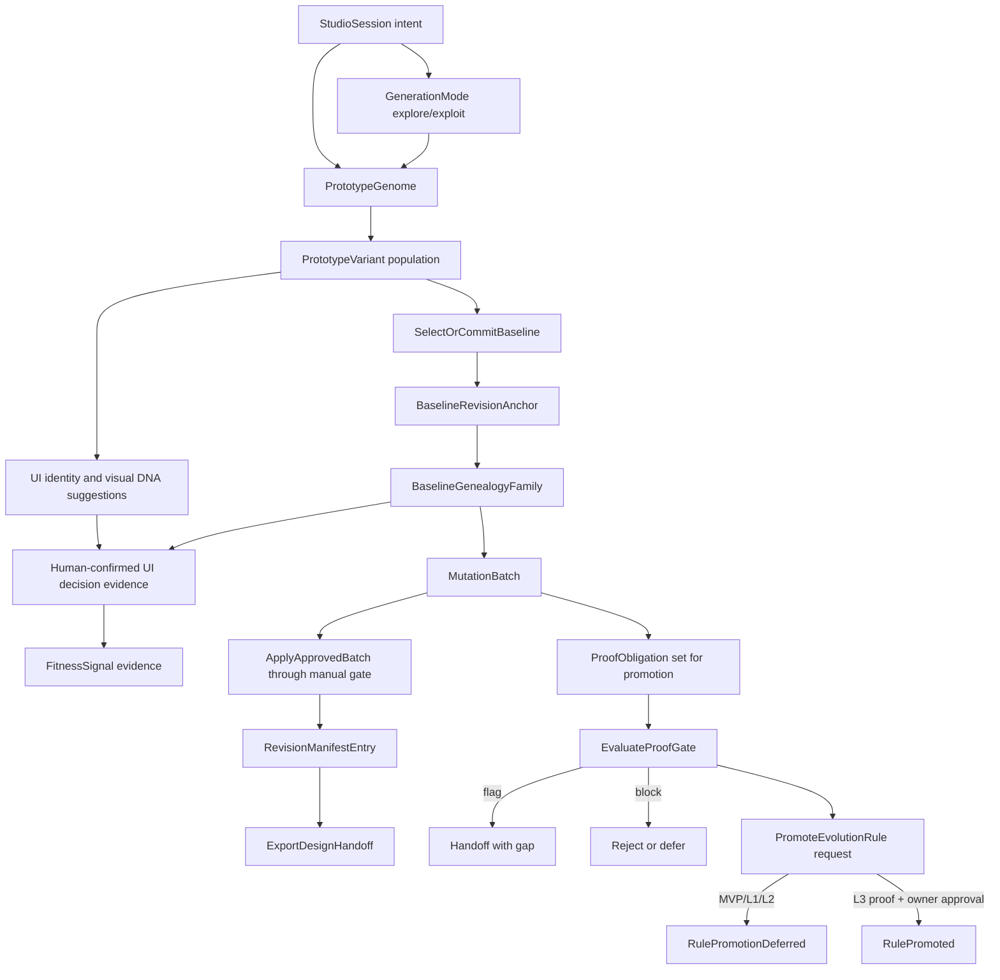

# UI Prototyping Studio Evolution Architecture

This document specifies the inside of the UI Prototyping Studio Evolution Engine. [ARCHITECTURE.md](ARCHITECTURE.md) remains the six-view system architecture; this file is the focused architecture for evolution observability, genealogy, proof gates, and later self-improvement. Existing formal IDs may retain `GodelDarwin` or `GodelProof` compatibility names.

## Purpose

The evolution architecture turns the studio loop into explicit, inspectable lineage:

`intent -> generation mode -> genome -> population -> selected family -> identity/DNA evidence -> fitness evidence -> mutation -> revision -> handoff -> proof-gated promotion`

The architecture is additive. MVP behavior includes Explore/Exploit generation, baseline selection, explicit baseline anchors, baseline family creation, identity/DNA confirmation, manual approval, stale-source checks, and append-only revision evidence. L1/L2/L3 add observability and proof machinery without changing normal apply gates unless a future path is explicitly proof-governed.

## Layer Scope

| Layer | Architecture Responsibility                 | Runtime Obligation                                                                                                | Out Of Scope                            |
| ----- | ------------------------------------------- | ----------------------------------------------------------------------------------------------------------------- | --------------------------------------- |
| MVP   | Accountable Explore/Exploit runtime         | Persist sessions, variants, baseline anchor/family, identity/DNA decisions, comments, batches, revisions, handoff | Automated ranking, proof-enforced apply |
| L0    | Explain current MVP as an evolutionary loop | None beyond existing MVP behavior                                                                                 | New scoring or promotion behavior       |
| L1    | Make evolution observable                   | Persist or derive `EvolutionCycle`, `FitnessSignal`, and richer read models                                       | Automated ranking, proof-enforced apply |
| L2    | Make proof gates enforceable                | Evaluate proof obligations and block unsafe rule promotion by default                                             | Durable rule promotion                  |
| L3    | Pilot governed self-improvement             | Promote generation rules only with proof pass, owner approval, and rollback evidence                              | Autonomous multi-cycle operation        |

## Evolution Engine

The lineage side is population, qualitative fitness evidence, selection, family, mutation, and lineage. The proof side is promotion evidence, gate status, deferral, and rollback.

## Component Boundary

| Component                     | Owns                                                                                                                                                                                         | Does Not Own                                 |
| ----------------------------- | -------------------------------------------------------------------------------------------------------------------------------------------------------------------------------------------- | -------------------------------------------- |
| `StudioOrchestrationModule`   | Sequencing existing session, variant, baseline, comment, batch, apply, and handoff operations                                                                                                | Evolution scoring policy                     |
| `GodelDarwinEvolutionAdapter` | Genome encoding, cycle read model, baseline family recording, UI identity/DNA proposal, decision evidence confirmation, fitness signal capture, proof evaluation, promotion request boundary | Direct UI mutation or bypassing manual apply |
| `RevisionManifestWriter`      | Append-only revision evidence after approved apply                                                                                                                                           | Generation-rule promotion                    |
| `GovernanceGateEvaluator`     | Approval, staleness, proof, and actor checks for gated paths                                                                                                                                 | Prototype rendering                          |
| `HandoffPublisher`            | Downstream readiness bundle with evolution/proof references when available                                                                                                                   | Changing source artifacts                    |

## Data Ownership

| Concept                   | Created By                                          | First Required Layer       | Cardinality                               | Idempotency Key                                                                      |
| ------------------------- | --------------------------------------------------- | -------------------------- | ----------------------------------------- | ------------------------------------------------------------------------------------ |
| `EvolutionCycle`          | `GenerateVariants` or L1 read-model projector       | L1                         | One active cycle per generated population | `(sessionId, generationIndex)`                                                       |
| `PrototypeGenome`         | `GodelDarwinEvolutionAdapter.encodePrototypeGenome` | L1                         | One encoded genome per cycle              | `(cycleId, genomeChecksum)`                                                          |
| `BaselineRevisionAnchor`  | `SelectOrCommitBaseline`                            | MVP                        | One anchor per baseline-ready cycle       | `(sessionId, generationIndex, selectedBaseline)`                                     |
| `UIElementIdentity`       | `ConfirmUIDecisionEvidence`                         | MVP                        | Many confirmed identities per family      | `(genealogyFamilyId, semanticName, canonicalRole, contentSubject)`                   |
| `UIElementInstance`       | `ConfirmUIDecisionEvidence`                         | MVP                        | Many rendered instances per identity      | `(identityId, variantLabel or revisionId, target)`                                   |
| `UIVisualSignature`       | `ConfirmUIDecisionEvidence`                         | MVP                        | Many signatures per identity/instance     | `(signatureId)` or implementation-defined visual DNA hash                            |
| `UIDecisionRecord`        | `ConfirmUIDecisionEvidence`                         | MVP                        | Many decisions per family                 | `(genealogyFamilyId, targetRef, decisionType, decidedAt)`                            |
| `FitnessSignal`           | `RecordFitnessSignal`                               | L1                         | Many per cycle                            | `(cycleId, source, targetRef, capturedAt)` or implementation-defined event ID        |
| `BaselineGenealogyFamily` | `SelectOrCommitBaseline`                            | MVP                        | One family per baseline-ready cycle       | `(sessionId, generationIndex, selectedBaseline.mode, selectedBaseline.variantLabel)` |
| `ProofObligation`         | `EvaluateProofGate` input or proof store            | L2                         | Many per cycle or promotion request       | `(cycleId, obligationId)`                                                            |
| `RevisionManifestEntry`   | `ApplyApprovedBatch`                                | MVP                        | One per successful apply                  | `revisionId`                                                                         |
| `RulePromotionRequest`    | `PromoteEvolutionRule`                              | L2 deferred, L3 promotable | Many per cycle                            | `(cycleId, ruleRef, requestedBy, requestedAt)`                                       |

## Baseline Family Recording

`BaselineGenealogyFamily` starts the durable lineage for a population after one candidate survives selection.

MVP:

- Multi-variant sessions require human baseline selection before annotation.
- Single-variant sessions commit the only candidate during variant generation.
- Baseline resolution creates an explicit `baselineRevisionId` and a genealogy family.

- The family is created or updated idempotently at the first baseline-ready point.
- Multi-variant sessions use the selected variant as the survivor.
- Single-variant sessions use the committed baseline as the survivor, even if `GenerateVariants` already moved the session to `BaselineReady`.
- The family links the generated population, selected baseline, baseline revision anchor, known fitness signals, confirmed UI element identities, decision records, and baseline visual DNA signatures.

This keeps single-variant and multi-variant sessions inside the same lineage model and gives Exploit a concrete family to conform to.

## Read Models

| Query                                                       | Output                                                                                                                                                                    | Notes                                                       |
| ----------------------------------------------------------- | ------------------------------------------------------------------------------------------------------------------------------------------------------------------------- | ----------------------------------------------------------- |
| [GetSessionSnapshot](queries.md#getsessionsnapshot)         | `baselineGenealogyFamily`, `baselineRevisionAnchor`                                                                                                                       | Null only before baseline readiness                         |
| [GetEvolutionCycle](queries.md#getevolutioncycle)           | `cycleId`, `generationIndex`, `genome`, `populationVariantLabels`, `fitnessSignalIds`, `selectedBaseline`, `genealogyFamilyId`, `mutationBatchId`, `proofStatus`, `state` | `genealogyFamilyId` is optional until the baseline is ready |
| [ListFitnessSignals](queries.md#listfitnesssignals)         | Ordered signal list for session or cycle                                                                                                                                  | Signals are evidence, not automated ranking in L1           |
| [ListUIDecisionEvidence](queries.md#listuidecisionevidence) | Confirmed `UIElementIdentity`, `UIElementInstance`, `UIVisualSignature`, and `UIDecisionRecord` records                                                                   | Generated suggestions are excluded until human-confirmed    |
| [ListRevisionManifest](queries.md#listrevisionmanifest)     | Existing revision evidence                                                                                                                                                | May include evolution references in later layers            |
| [GetHandoffBundle](queries.md#gethandoffbundle)             | Existing handoff plus optional evolution/proof references                                                                                                                 | Does not imply rule promotion                               |

## Gate Rules

| Gate               | MVP                                                      | L1                               | L2                                                     | L3                                                                  |
| ------------------ | -------------------------------------------------------- | -------------------------------- | ------------------------------------------------------ | ------------------------------------------------------------------- |
| Baseline selection | Required for multi-variant; committed for single-variant | Also records family idempotently | Same as L1                                             | Same as L1                                                          |
| Mutation synthesis | Deterministic from ordered comments                      | May attach cycle/family refs     | Same as L1                                             | Same as L1                                                          |
| Apply              | Manual approval and non-stale source required            | Same as MVP                      | Same as MVP unless explicitly proof-governed           | Same as L2                                                          |
| Handoff            | Revision evidence required                               | May include evolution references | May include proof gaps/status                          | May include promoted-rule provenance                                |
| Rule promotion     | Deferred                                                 | Deferred                         | Blocked/deferred unless proof passes and policy allows | Allowed only with proof pass, owner approval, and rollback evidence |

## Interface Responsibilities

| Interface Method                   | Layer | Responsibility                                                                                            |
| ---------------------------------- | ----- | --------------------------------------------------------------------------------------------------------- |
| `encodePrototypeGenome(input)`     | L1    | Build normalized genome from prompt, constraints, components, comments, tasks, and environment references |
| `recordBaselineFamily(input)`      | MVP   | Create/update family record for selected or committed baseline                                            |
| `proposeUIIdentityEvidence(input)` | MVP   | Suggest element identities, rendered instances, and visual DNA from generated variant artifacts           |
| `confirmUIIdentityEvidence(input)` | MVP   | Persist human-confirmed identity, instance, visual signature, and decision records                        |
| `recordFitnessSignal(input)`       | L1    | Capture qualitative or test-backed selection pressure                                                     |
| `evaluateProofGate(input)`         | L2    | Compute `pass`, `flag`, or `block` deterministically                                                      |
| `promoteEvolutionRule(input)`      | L2/L3 | Defer in MVP/L1/L2; promote only in L3 when proof, approval, and rollback criteria pass                   |

## Failure Semantics

| Condition                                                     | Result                                                                                            |
| ------------------------------------------------------------- | ------------------------------------------------------------------------------------------------- |
| Baseline family projector sees the same baseline twice        | Return existing family or update missing refs idempotently                                        |
| Generated UI identity/DNA evidence is not human-confirmed     | Keep it as suggestion only; do not attach as durable genealogy evidence                           |
| Visual DNA uses value outside controlled taxonomy             | Reject with validation error                                                                      |
| Fitness signal references unknown cycle                       | Reject with validation error                                                                      |
| Proof obligations are empty for proof-governed promotion path | `block`                                                                                           |
| Any proof obligation blocks                                   | Block promotion; normal MVP apply remains governed by manual approval, actor, and staleness gates |
| Any proof obligation flags and none block                     | `flag`; handoff may continue with gap, promotion blocked                                          |
| Rule promotion requested before L3                            | Record deferred/rejected outcome, do not mutate generation rules                                  |
| Actor is `system:auto` on apply or promotion                  | Reject or block according to gate policy                                                          |

## Work-Pack Mapping

| Work-Pack                                                                | Architecture Slice                                           |
| ------------------------------------------------------------------------ | ------------------------------------------------------------ |
| [UPS-WP-04-SPEC-REFRESH](work-pack/tasks/TASK-UPS-WP-04-SPEC-REFRESH.md) | L0 architecture/spec alignment                               |
| [UPS-WP-05-EVOLUTION](work-pack/tasks/TASK-UPS-WP-05-EVOLUTION.md)       | L1 evolution cycle, baseline family, fitness signal surfaces |
| [UPS-WP-06-PROOF-GATE](work-pack/tasks/TASK-UPS-WP-06-PROOF-GATE.md)     | L2 proof obligation evaluation and deferral gates            |
| [UPS-WP-07-PROMOTION](work-pack/tasks/TASK-UPS-WP-07-PROMOTION.md)       | L3 governed rule-promotion pilot                             |

## Open Architecture Questions

| Question                                   | Status   | Resolution Path                                                                                         |
| ------------------------------------------ | -------- | ------------------------------------------------------------------------------------------------------- |
| Fitness scoring model                      | open     | Resolve O-004 in [DECISIONS.md](DECISIONS.md#open-decisions) before weighted ranking                    |
| Promotable generation-rule types           | open     | Resolve O-005 in [DECISIONS.md](DECISIONS.md#open-decisions) before L3                                  |
| Runtime proof storage schema               | deferred | Select during `UPS-WP-06-PROOF-GATE`                                                                    |
| Evolution read-model storage shape         | deferred | Select during `UPS-WP-05-EVOLUTION`                                                                     |
| UI identity/visual DNA taxonomy versioning | deferred | Select during `UPS-WP-05-EVOLUTION`; controlled vocabulary starts bounded and evolves through decisions |
