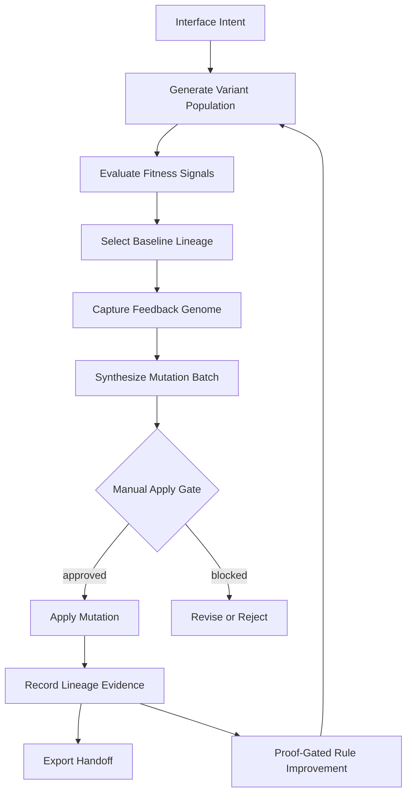
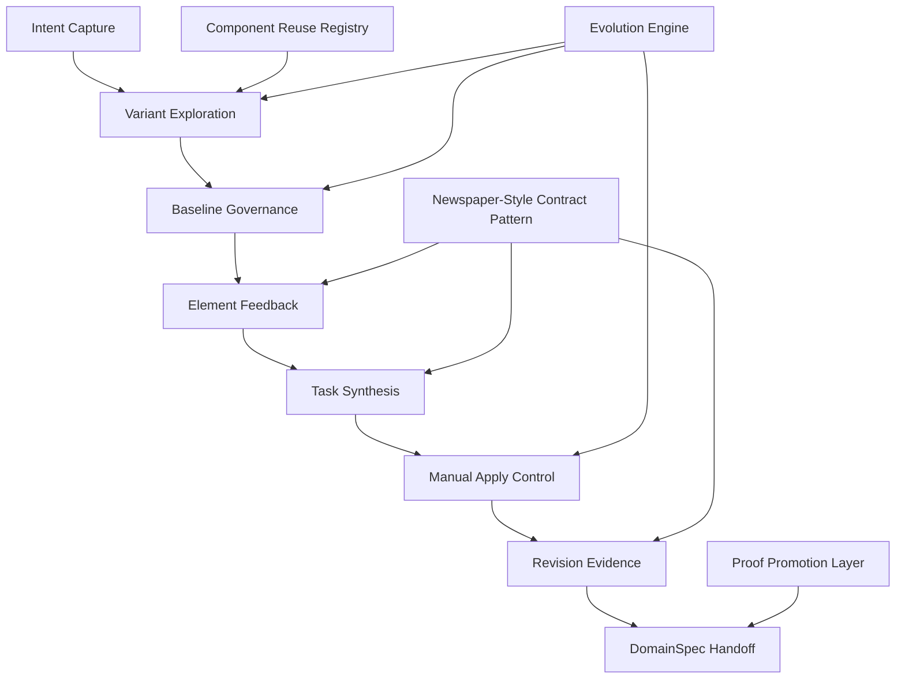

# UI Prototyping Studio - Conceptual Capability View

## Concept

UI Prototyping Studio is a governed design-iteration system for turning interface intent into traceable prototype evolution.

It sits between early product imagination and formal UI implementation. The studio lets teams explore possible interfaces, choose a baseline, annotate it, convert feedback into structured work, and preserve the decisions that led from idea to implementation-ready artifact.

The central concept is not "generate a screen." The central concept is **make UI exploration accountable**.

## Product Thesis

Modern UI prototyping is fast, but often loses the reasoning trail. Feedback lives in chat, screenshots, comments, or memory. Implementation then starts with ambiguity: which variant won, which comments mattered, which changes were approved, and what evidence supports the next step?

UI Prototyping Studio answers with a capability stack wrapped around an internal Evolution Engine:

- **Explore** creates bounded candidate directions.
- **Exploit** creates baseline-conforming candidates from confirmed identity and visual DNA.
- **Selection** turns options into an intentional baseline.
- **Identity and Visual DNA** preserve what UI elements are, why they were chosen, and which visual traits define them.
- **Annotation** captures feedback at the element level.
- **Synthesis** turns feedback into deterministic work.
- **Governance** keeps mutation under human control.
- **Revision Evidence** records what changed and why.
- **Handoff** connects the loop to DomainSpec delivery artifacts.

The public product idea is accountable UI exploration. The internal architecture is an **Evolution Engine**: a system that generates variants, records qualitative selection evidence, mutates the chosen lineage through manual gates, and only lets the generation process improve itself when proof/evidence says the change is acceptable.

## Evolutionary Frame

The studio can be understood as a genetic loop for product interfaces.

| Genetic Concept  | Studio Concept                                                                | Meaning                                                     |
| ---------------- | ----------------------------------------------------------------------------- | ----------------------------------------------------------- |
| Genome           | Prompt, component metadata, constraints, comments, and mutation tasks         | The encoded instructions that shape the next prototype      |
| Phenotype        | Rendered HTML-first prototype variant                                         | The visible expression of the genome                        |
| Population       | Candidate variants A/B/C                                                      | The set of competing interface possibilities                |
| Fitness Evidence | Human selection, severity, intent, risk, acceptance checks, and tests         | Evidence that explains why a path was preferred or rejected |
| Selection        | Baseline choice or committed single-variant path                              | The decision that chooses a lineage                         |
| Identity DNA     | UI element identity, rendered instance, visual signature, and decision record | The inheritable design traits preserved or changed          |
| Family           | Baseline genealogy family                                                     | The first durable record of the selected lineage            |
| Mutation         | Approved task batch applied to the baseline                                   | The controlled change that creates the next revision        |
| Lineage          | Revision manifest                                                             | The ancestry of decisions, changes, and evidence            |
| Environment      | DomainSpec requirements, UI-SPEC, test obligations, architecture constraints  | The world each prototype must survive in                    |

This makes the product more than a prototyping canvas. It is a controlled evolution system where interface variants are compared, selected traits are preserved, and approved mutations create the next generation.

## Evolution Engine

The Evolution Engine framing adds a second layer: the system does not merely evolve prototype outputs; it can evolve its own design process when evidence justifies the change.

In this feature, that means:

- **Lineage side:** generate populations, capture selection evidence, preserve winning lineages, and mutate through approved batches.
- **Proof side:** require explicit proof obligations before the process changes itself: checksums, gates, tests, manifests, and handoff evidence.

Existing formal concept IDs may still use `GodelDarwin` or `GodelProof` for compatibility, but product prose should describe this as the Evolution Engine.

The MVP proves the first controlled loop. Later phases can deepen the self-improvement layer by letting accumulated evidence tune generation heuristics, component-selection rules, prompt templates, critique rubrics, and mutation strategies.

## Who It Serves

| Audience   | Need                                          | Studio Answer                                                                      |
| ---------- | --------------------------------------------- | ---------------------------------------------------------------------------------- |
| Designer   | Explore multiple interface directions quickly | Bounded variant generation with rationale, tradeoffs, risk, and component usage    |
| Reviewer   | Give precise feedback on prototype elements   | Structured target, severity, intent, and note capture                              |
| PM or lead | Convert feedback into actionable iteration    | Deterministic mutation batch synthesis and manual approval                         |
| Engineer   | Preserve provenance before implementation     | Revision manifest and handoff bundle linked to DomainSpec docs                     |
| QA         | Verify behavior against clear obligations     | Playwright coverage for route, gates, state transitions, security, and apply rules |

## Capability Model

## Capability View

| Capability           | Product Meaning                                                       | Core Questions It Answers                                                 | Evidence In MVP                                                           |
| -------------------- | --------------------------------------------------------------------- | ------------------------------------------------------------------------- | ------------------------------------------------------------------------- |
| Intent Capture       | Converts a product idea into a studio session                         | What are we trying to prototype? How many options do we want?             | Session controls, prompt submission, `variantCount` contract              |
| Variant Exploration  | Produces bounded candidate prototype directions                       | What are the viable UI directions? What are their tradeoffs?              | Candidate A/B/C previews with rationale, risk, components used            |
| Baseline Governance  | Establishes a chosen source of truth before feedback                  | Which option are we iterating? Was it selected or committed?              | Selection gate, committed single-variant path                             |
| Element Feedback     | Captures visual critique as structured data                           | What element is affected? How severe is it? What is the intent?           | Annotation panel, canonical comment payload                               |
| Task Synthesis       | Converts comments into replayable mutation work                       | What tasks should the next revision perform? Is the output deterministic? | Draft mutation batch and task list                                        |
| Manual Apply Control | Requires explicit approval before prototype mutation                  | Who approved the change? Is auto-apply blocked?                           | Approval gate and disabled apply control                                  |
| Revision Evidence    | Records each applied change as provenance                             | What changed? From which baseline? Which tasks were applied?              | Revision timeline and manifest entries                                    |
| DomainSpec Handoff   | Bridges exploration into delivery workflow                            | Which stories, specs, tests, and implementation paths are ready?          | Handoff summary and bundle references                                     |
| Evolution Engine     | Treats variants and revisions as a selected/mutated lineage           | What survived, why, and what should evolve next?                          | Variant population, baseline selection, mutation batch, revision manifest |
| Proof Layer          | Allows generation-process improvement only when proof evidence passes | What proves self-improvement is allowed?                                  | Deferred promotion request, proof vocabulary, future proof obligations    |

## Capability Details

### 1. Intent Capture

The studio starts with a prompt and a bounded exploration size. `variantCount` is deliberately limited to `1..3` so the session stays comparable, reviewable, and testable.

Conceptually, this capability establishes:

- the user's design intent,
- the desired breadth of exploration,
- the session identity,
- the first traceable input into the product loop.

### 2. Variant Exploration

Variant generation is not open-ended ideation. It creates a small set of comparable prototype candidates with consistent metadata:

- components used,
- rationale,
- tradeoffs,
- risk,
- artifact reference.

This makes the review conversation about explicit options instead of vague preference.

### 3. Baseline Governance

The baseline is the studio's anchor. Every comment, task, and revision must attach to a known prototype revision.

There are two baseline modes:

| Mode        | When It Happens    | Meaning                                                                                   |
| ----------- | ------------------ | ----------------------------------------------------------------------------------------- |
| `selected`  | `variantCount > 1` | A human chose one candidate before annotation began                                       |
| `committed` | `variantCount = 1` | The single generated candidate becomes the baseline through the single-option commit path |

This is the feature's first major governance move: it prevents downstream work from being attached to an ambiguous option.

### 4. Element Feedback

Comments are treated as structured product events, not informal notes.

Each comment captures:

- target selector,
- element label,
- severity,
- intent,
- note,
- actor and timestamp.

This lets visual critique become queryable, replayable, and suitable for deterministic task synthesis.

### 5. Task Synthesis

The synthesizer turns ordered comment events into a mutation batch. The conceptual goal is repeatability: the same ordered input should produce the same task payload and checksum.

This capability is what converts "feedback" into "work."

### 6. Manual Apply Control

The MVP forbids auto-apply. The system can generate tasks and prepare a revision, but a human must approve before the prototype changes.

This creates a clear responsibility boundary:

- the system proposes,
- the reviewer approves,
- the apply operation records evidence.

### 7. Revision Evidence

Every successful apply appends a manifest entry. The manifest is the studio's memory of the iteration loop.

Each entry preserves:

- revision identity,
- parent revision,
- baseline provenance,
- applied batch,
- applied task IDs,
- unresolved comment IDs,
- diff summary.

This turns prototype evolution into an auditable trail.

### 8. DomainSpec Handoff

The handoff capability connects the studio to the broader DomainSpec pipeline:

- stories,
- requirements,
- acceptance criteria,
- UI specification,
- test specification,
- implementation readiness.

The result is a transition from exploration to delivery without flattening the reasoning that happened during exploration.

### 9. Evolution Engine

The evolution engine is the conceptual heart of the studio. It turns the interface process into a lineage:

- generate a small population,
- select a baseline,
- save the selected baseline's genealogy family,
- encode critique as structured genome data,
- synthesize mutations,
- apply only approved mutations,
- record the resulting generation.

This gives the product a durable memory of why one UI path survived and another did not.

### 10. Proof Layer

The proof layer is what makes the evolutionary loop safe enough for DomainSpec. Mutation is allowed only when the system can show the right evidence:

- baseline gate satisfied,
- ordered comments captured,
- deterministic batch synthesized,
- approval metadata present,
- stale revision checks passed,
- auto-apply blocked,
- revision manifest appended,
- test obligations mapped.

This is the Godel half of the machine: the loop can evolve, but it must explain and verify the evolution.

## Conceptual Architecture

| Layer               | Responsibility                                                                            |
| ------------------- | ----------------------------------------------------------------------------------------- |
| Workbench Layer     | Presents the session, variants, annotation, mutation, revision, and handoff surfaces      |
| Orchestration Layer | Controls session transitions, gates, synthesis, approval, and apply                       |
| Contract Layer      | Defines stable comment, mutation batch, revision manifest, and handoff payload shapes     |
| Evidence Layer      | Stores revision history, provenance, state, and executable test obligations               |
| Evolution Layer     | Manages population, selection, mutation, lineage, and future fitness signals              |
| Proof Layer         | Enforces gate checks, deterministic synthesis, and evidence required for self-improvement |
| DomainSpec Bridge   | Connects outputs to UI-SPEC, TEST-SPEC, stories, and implementation flow                  |

## Capability Relationships

The capabilities form a controlled loop:

1. **Intent Capture** creates a session.
2. **Variant Exploration** creates possible directions.
3. **Baseline Governance** chooses the direction to evolve.
4. **Element Feedback** records critique against that baseline.
5. **Task Synthesis** turns critique into work.
6. **Manual Apply Control** authorizes mutation.
7. **Revision Evidence** records the result.
8. **DomainSpec Handoff** exports the result into delivery artifacts.

This loop can repeat until the team has enough confidence to formalize the interface.

Seen through the genetic frame:

1. A prompt and constraints encode the first genome.
2. Variants express that genome as phenotypes.
3. Human and test feedback provide fitness pressure.
4. Baseline selection chooses the surviving lineage.
5. The baseline genealogy family records the whole population and the chosen survivor.
6. Mutation batches propose controlled genetic edits.
7. Proof gates decide whether edits may enter the lineage.
8. Revision manifests preserve ancestry.
9. Accumulated evidence improves future generation strategy.

## Current Product Surface

Route: `/ui-prototyping-studio`

The workbench is organized into six visible surfaces:

| Surface                 | What It Communicates                                                                          |
| ----------------------- | --------------------------------------------------------------------------------------------- |
| Session Controls        | Start a session, choose `variantCount` from `1..3`, submit a prompt, and generate variants    |
| Variant Canvas          | Review candidate A/B/C previews, metadata, artifact refs, components used, and baseline state |
| Annotation Panel        | Capture targeted comments only after baseline readiness                                       |
| Mutation Approval Panel | Synthesize draft tasks, approve manually, and apply only after approval                       |
| Revision Timeline       | Show append-only revision manifest rows after successful applies                              |
| Handoff Summary         | Surface readiness and references for stories, spec, UI spec, and test spec                    |

## Governance Model

The MVP is intentionally manual at the moments where product decisions become durable.

| Gate                    | Rule                                              | Why It Matters                                                     |
| ----------------------- | ------------------------------------------------- | ------------------------------------------------------------------ |
| Variant count           | Only `1`, `2`, or `3`; default is `3`             | Keeps comparison bounded and testable                              |
| Baseline selection      | Required when `variantCount > 1`                  | Prevents comments and tasks from floating across unchosen variants |
| Single-variant path     | `variantCount = 1` commits baseline `A`           | Supports fast iteration without false ceremony                     |
| Annotation lock         | Comments unlock only after baseline readiness     | Keeps feedback tied to a revision head                             |
| Apply approval          | Draft batch must be explicitly approved           | Prevents automatic prototype mutation                              |
| Server-side enforcement | Auto-apply attempts return `AUTO_APPLY_FORBIDDEN` | Makes governance independent from UI state                         |

## Strategic Differentiator

Most prototyping tools optimize for speed, visual fidelity, or code generation. This feature optimizes for a governed evolutionary loop that can survive handoff.

The valuable product shape is:

- **Bounded exploration:** variants are capped at three, with equal metadata for comparison.
- **Intentional baseline:** multi-option sessions require a human choice before iteration.
- **Structured feedback:** comments carry target, severity, intent, and note instead of free-floating chat.
- **Deterministic synthesis:** the same ordered comments produce the same draft task batch.
- **Manual apply:** the system can suggest and prepare, but the human approves before mutation.
- **Traceable revisions:** each apply appends a manifest row with provenance.
- **DomainSpec handoff:** output points back into stories, requirements, UI spec, and test spec.
- **Genetic learning:** variants, comments, tasks, and manifests become reusable fitness data.
- **Godel-style proof:** process changes are justified by explicit gates, invariants, and evidence.

## Presentation Frame

For a conceptual presentation, lead with these three statements:

1. **This is a bridge from ideation to implementation.**
   It makes early UI exploration compatible with DomainSpec's formal delivery pipeline.

2. **The product value is traceability, not just generation.**
   Every important transition is represented as state, gate, task, revision, or handoff evidence.

3. **The MVP proves the governance loop.**
   The current surface demonstrates bounded variants, baseline gating, structured feedback, manual approval, revision evidence, and downstream handoff readiness.

4. **The long-term engine is evolutionary.**
   The studio becomes more valuable as every prototype generation leaves behind fitness data that can improve the next generation.

## Executable Evidence

| Evidence     | Product Behavior Proven                                                  |
| ------------ | ------------------------------------------------------------------------ |
| `UPS-UI-001` | Route exposes authenticated workbench shell                              |
| `UPS-UI-002` | Required panels render as one product surface                            |
| `UPS-UI-003` | Variant count selector is bounded to `1`, `2`, `3`                       |
| `UPS-UI-004` | Multi-variant sessions lock annotation until explicit baseline selection |
| `UPS-UI-005` | Single-variant sessions use committed baseline mode                      |
| `UPS-UI-006` | Apply remains disabled until manual approval                             |
| `UPS-UI-007` | State indicator follows the session lifecycle                            |
| `UPS-UI-008` | Escaped text rendering and server-side auto-apply rejection are enforced |

## Product Status

This view represents the current MVP contract and e2e behavior:

- Implemented route and workbench composition.
- Implemented API client surface for sessions, variants, comments, mutation batches, revisions, and handoff.
- Implemented Playwright mock API for deterministic product walkthroughs.
- Implemented e2e coverage for WP-01 through WP-03 behaviors.
- Spec target added for baseline genealogy families: baseline selection should persist the generated population, selected survivor, actor, timestamp, and revision anchor before later mutation ancestry is recorded.

The next product lift is to make the evolutionary memory visible: show the baseline family alongside the workbench lineage, then mature the surface so it feels less like a contract dashboard and more like a polished collaborative prototyping studio while preserving the same gates and evidence model.
