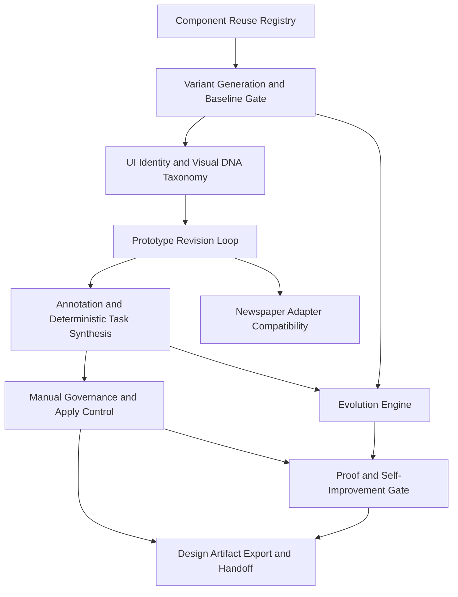

# UI Prototyping Studio

## Overview

UI Prototyping Studio is a DomainSpec-native feature for rapid UI exploration with deterministic governance.
It receives a user prompt, generates HTML-first variants, enforces baseline gating semantics, captures element-level comments, synthesizes deterministic mutation batches, and appends revision evidence for downstream UI delivery stages.
The product thesis is accountable UI exploration: the studio makes every generated option, baseline choice, identity decision, visual trait, approved mutation, and handoff artifact traceable.
Internally, the feature uses an Evolution Engine architecture: variants form a bounded population, human/test feedback provides qualitative fitness evidence, approved mutation batches evolve the selected lineage, and proof obligations gate any durable self-improvement of generation rules.

Discovery baseline:

- [DISCOVERY.md](DISCOVERY.md)

Story baseline:

- [STORIES.md](STORIES.md)

Reference inventory:

- [inventory/README.md](inventory/README.md)
- [inventory/skills-references/open-design/INVENTORY.md](inventory/skills-references/open-design/INVENTORY.md)

## What This Module Owns

- Prompt-to-variant generation with strict `variantCount` contract (`1..3`, default `3`).
- MVP Explore/Exploit generation modes: Explore offers new directions; Exploit offers baseline-conforming candidates.
- Deterministic baseline gate behavior for both multi-option and single-option runs.
- HTML-first revision loop (`comment -> task -> approval -> apply -> manifest append`).
- Manual governance controls that forbid auto-apply in MVP.
- Adapter-only compatibility with newspaper contract shape (no runtime coupling).
- UI identity and visual DNA evidence for tracking conceptual elements, visual signatures, and human-confirmed decisions across Explore/Exploit genealogy.
- Evolution Engine semantics for population, qualitative fitness evidence, selection, mutation, lineage, and environment evidence.
- Proof gates that prevent self-improvement or generation-rule promotion without explicit evidence; normal MVP apply remains manually governed.
- Design artifact handoff for `domainspec-ui-phase-bridge`, `domainspec-generate-tests --ui`, and `domainspec-ui-implement`.

## Module Map

## Capabilities

| Capability                                                                                  | What                                                                                            | Key Aspects                                                                            | Detail                                                           |
| ------------------------------------------------------------------------------------------- | ----------------------------------------------------------------------------------------------- | -------------------------------------------------------------------------------------- | ---------------------------------------------------------------- |
| [Component Reuse Registry](#component-reuse-registry)                                       | Indexes reusable design-system primitives for prototype assembly                                | [domain.md](domain.md), [queries.md](queries.md), [UI-SPEC.md](UI-SPEC.md)             | Registry metadata and bounded reuse constraints                  |
| [UI Identity and Visual DNA Taxonomy](#ui-identity-and-visual-dna-taxonomy)                 | Captures conceptual element identity, visual DNA, and human-confirmed decisions                 | [domain.md](domain.md), [operations.md](operations.md), [queries.md](queries.md)       | Controlled taxonomy for genealogy evidence                       |
| [Variant Generation and Baseline Gate](#variant-generation-and-baseline-gate)               | Generates `1..3` variants and enforces deterministic baseline readiness                         | [operations.md](operations.md), [states.md](states.md), [interfaces.md](interfaces.md) | Default `3`; committed baseline semantics for `variantCount = 1` |
| [Prototype Revision Loop](#prototype-revision-loop)                                         | Runs deterministic revision cycle from prompt to manifest append                                | [operations.md](operations.md), [workflows.md](workflows.md), [states.md](states.md)   | Single-loop MVP with explicit transitions                        |
| [Annotation and Deterministic Task Synthesis](#annotation-and-deterministic-task-synthesis) | Converts canonical comment events into deterministic mutation tasks                             | [domain.md](domain.md), [operations.md](operations.md), [queries.md](queries.md)       | Canonical comment schema and replayable synthesis                |
| [Manual Governance and Apply Control](#manual-governance-and-apply-control)                 | Enforces manual approvals for baseline and apply gates                                          | [workflows.md](workflows.md), [states.md](states.md), [TEST-SPEC.md](TEST-SPEC.md)     | Auto-apply forbidden in all MVP paths                            |
| [Newspaper Adapter Compatibility](#newspaper-adapter-compatibility)                         | Reuses newspaper contract shape without runtime dependency                                      | [domain.md](domain.md), [interfaces.md](interfaces.md), [DECISIONS.md](DECISIONS.md)   | Internal mapper only                                             |
| [Evolution Engine](#evolution-engine)                                                       | Treats variants and revisions as population, fitness evidence, selection, mutation, and lineage | [domain.md](domain.md), [operations.md](operations.md), [workflows.md](workflows.md)   | Internal lineage and observability model                         |
| [Proof and Self-Improvement Gate](#proof-and-self-improvement-gate)                         | Allows generation-rule improvement only after proof obligations pass                            | [domain.md](domain.md), [operations.md](operations.md), [states.md](states.md)         | Promotion gate; normal MVP apply is not proof-gated              |
| [Design Artifact Export and Handoff](#design-artifact-export-and-handoff)                   | Produces handoff bundles for UI bridge, tests, and implementation                               | [queries.md](queries.md), [UI-SPEC.md](UI-SPEC.md), [TEST-SPEC.md](TEST-SPEC.md)       | Capability-aware downstream readiness                            |

### Component Reuse Registry

Maintains deterministic component metadata used during prototype generation and revision apply.

| Aspect | Concept                                               | Summary                                            |
| ------ | ----------------------------------------------------- | -------------------------------------------------- |
| Domain | [PrototypeVariant](domain.md#prototypevariant)        | Records `componentsUsed` for each generated option |
| Query  | [ListSessionVariants](queries.md#listsessionvariants) | Exposes variant metadata for review surfaces       |
| UI     | [Component Inventory](UI-SPEC.md#component-inventory) | Defines bounded studio surfaces and controls       |

### UI Identity and Visual DNA Taxonomy

Defines how Explore and Exploit preserve the identity and visual DNA of UI elements across genealogy. In MVP, generated identity/DNA is suggested during generation and becomes durable only after human confirmation.

| Aspect    | Concept                                                              | Summary                                                                    |
| --------- | -------------------------------------------------------------------- | -------------------------------------------------------------------------- |
| Domain    | [UIElementIdentity](domain.md#uielementidentity)                     | Stable conceptual element identity across variants and revisions           |
| Domain    | [UIVisualSignature](domain.md#uivisualsignature)                     | Controlled color, shape, typography, layout, interaction, and semantic DNA |
| Domain    | [UIDecisionRecord](domain.md#uidecisionrecord)                       | Human-confirmed reason an identity or visual trait was selected or changed |
| Operation | [ConfirmUIDecisionEvidence](operations.md#confirmuidecisionevidence) | Makes generated identity/DNA suggestions durable genealogy evidence        |
| Query     | [ListUIDecisionEvidence](queries.md#listuidecisionevidence)          | Exposes confirmed identity, instance, visual DNA, and decision records     |

### Variant Generation and Baseline Gate

Defines bounded variant generation and baseline gate semantics.

| Aspect    | Concept                                                        | Summary                                                                                |
| --------- | -------------------------------------------------------------- | -------------------------------------------------------------------------------------- |
| Domain    | [GenerationMode](domain.md#generationmode)                     | Selects `explore` or `exploit` generation behavior                                     |
| Operation | [GenerateVariants](operations.md#generatevariants)             | Emits exactly `variantCount` HTML-first candidates                                     |
| Operation | [SelectOrCommitBaseline](operations.md#selectorcommitbaseline) | Enforces explicit select for `variantCount > 1`; committed path for `variantCount = 1` |
| State     | [StudioSessionState](states.md#studiosessionstate)             | Captures `VariantsReady -> BaselineReady` guards                                       |

### Prototype Revision Loop

Owns the deterministic sequence from prompt capture through revision manifest append.

| Aspect    | Concept                                                               | Summary                                            |
| --------- | --------------------------------------------------------------------- | -------------------------------------------------- |
| Workflow  | [MVPStudioIterationWorkflow](workflows.md#mvpstudioiterationworkflow) | Canonical MVP orchestration                        |
| Operation | [ApplyApprovedBatch](operations.md#applyapprovedbatch)                | Applies approved mutation batch to active baseline |
| Query     | [ListRevisionManifest](queries.md#listrevisionmanifest)               | Exposes immutable revision evidence                |

### Annotation and Deterministic Task Synthesis

Defines canonical comment schema and deterministic task conversion behavior.

| Aspect    | Concept                                                          | Summary                                                            |
| --------- | ---------------------------------------------------------------- | ------------------------------------------------------------------ |
| Domain    | [CommentEvent](domain.md#commentevent)                           | Canonical comment payload (`target`, `severity`, `intent`, `note`) |
| Operation | [SynthesizeMutationBatch](operations.md#synthesizemutationbatch) | Deterministic batch generation from ordered comments               |
| Query     | [GetDraftMutationBatch](queries.md#getdraftmutationbatch)        | Review payload before approval                                     |

### Manual Governance and Apply Control

Defines mandatory gate checks and manual approvals.

| Aspect     | Concept                                                     | Summary                                            |
| ---------- | ----------------------------------------------------------- | -------------------------------------------------- |
| Policy     | [GovernanceGatePolicy](workflows.md#governancegatepolicy)   | Applies baseline and approval gates                |
| Operation  | [ApproveMutationBatch](operations.md#approvemutationbatch)  | Explicit approval transition (`draft -> approved`) |
| Invariants | [Governance and Invariants](#governance-and-invariants-mvp) | Auto-apply forbidden and audited                   |

### Newspaper Adapter Compatibility

Preserves reusable contract shape without runtime imports.

| Aspect    | Concept                                                                               | Summary                                   |
| --------- | ------------------------------------------------------------------------------------- | ----------------------------------------- |
| Interface | [NewspaperContractAdapter](interfaces.md#internal-newspapercontractadapter-interface) | Internal mapping boundary only            |
| Domain    | [MutationBatch](domain.md#mutationbatch)                                              | Contract-compatible mutation bundle       |
| Decision  | [Locked MVP decisions](DECISIONS.md#locked-mvp-decisions-d-001-d-007)                 | D-007 forbids runtime dependency coupling |

### Design Artifact Export and Handoff

Publishes deterministic handoff artifacts for downstream stages.

| Aspect | Concept                                                                 | Summary                                             |
| ------ | ----------------------------------------------------------------------- | --------------------------------------------------- |
| Query  | [GetHandoffBundle](queries.md#gethandoffbundle)                         | Produces UI/test/implementation contract references |
| UI     | [Route Table](UI-SPEC.md#route-table)                                   | Captures route and interaction obligations          |
| Tests  | [Contract Obligations Matrix](TEST-SPEC.md#contract-obligations-matrix) | Bridges stories, FRs, ACs, and evidence             |

### Evolution Engine

Defines the studio as a bounded evolution loop for UI prototypes. The formal concept IDs retain `GodelDarwin` compatibility names where already established.

| Aspect    | Concept                                                                   | Summary                                                                          |
| --------- | ------------------------------------------------------------------------- | -------------------------------------------------------------------------------- |
| Domain    | [EvolutionCycle](domain.md#evolutioncycle)                                | Groups one population, selected lineage, mutation batch, and proof state         |
| Domain    | [PrototypeGenome](domain.md#prototypegenome)                              | Encodes prompt, component constraints, comments, and mutation tasks              |
| Operation | [RecordFitnessSignal](operations.md#recordfitnesssignal)                  | Captures human/test/acceptance pressure for generated candidates                 |
| Workflow  | [GodelDarwinEvolutionWorkflow](workflows.md#godeldarwinevolutionworkflow) | Extends MVP loop with population, fitness evidence, lineage, and proof semantics |

### Proof and Self-Improvement Gate

Defines proof obligations required before any generation-rule or strategy change becomes durable. It does not govern normal MVP apply, which remains controlled by baseline readiness, manual approval, non-stale source revision, and non-auto actor checks.

| Aspect    | Concept                                                    | Summary                                                                  |
| --------- | ---------------------------------------------------------- | ------------------------------------------------------------------------ |
| Domain    | [ProofObligation](domain.md#proofobligation)               | Required evidence item for mutation or rule promotion                    |
| Operation | [EvaluateProofGate](operations.md#evaluateproofgate)       | Computes pass/flag/block over proof obligations                          |
| Operation | [PromoteEvolutionRule](operations.md#promoteevolutionrule) | Deferred operation for generation-rule self-improvement                  |
| State     | [EvolutionCycleState](states.md#evolutioncyclestate)       | Tracks population, fitness, mutation, proof, and promoted/deferred paths |

## Domain Concepts

| Concept                                                      | Type          | Key Constraints                                                                 |
| ------------------------------------------------------------ | ------------- | ------------------------------------------------------------------------------- |
| [StudioSession](domain.md#studiosession)                     | Entity        | Persists `variantCount`, baseline provenance, revision head, and gate state     |
| [PrototypeVariant](domain.md#prototypevariant)               | Entity        | Exactly one row per generated candidate in current cycle                        |
| [CommentEvent](domain.md#commentevent)                       | Entity        | Must conform to canonical schema and severity enum                              |
| [MutationBatch](domain.md#mutationbatch)                     | Entity        | Starts as `draft`; requires explicit approval before apply                      |
| [RevisionManifestEntry](domain.md#revisionmanifestentry)     | Entity        | One append-only record per successful apply                                     |
| [EvolutionCycle](domain.md#evolutioncycle)                   | Entity        | One governed population-to-lineage cycle inside a studio session                |
| [BaselineGenealogyFamily](domain.md#baselinegenealogyfamily) | Entity        | Durable family record created when one baseline survives a generated population |
| [FitnessSignal](domain.md#fitnesssignal)                     | Entity        | Captures human/test/acceptance pressure applied to a variant or revision        |
| [UIElementIdentity](domain.md#uielementidentity)             | Entity        | Durable conceptual UI element identity for genealogy                            |
| [UIElementInstance](domain.md#uielementinstance)             | Entity        | Rendered occurrence of a conceptual element in a variant or revision            |
| [UIDecisionRecord](domain.md#uidecisionrecord)               | Entity        | Human-confirmed decision evidence for identity and visual DNA                   |
| [RulePromotionRequest](domain.md#rulepromotionrequest)       | Entity        | Deferred or governed self-improvement request                                   |
| [VariantCount](domain.md#variantcount)                       | Value Object  | Allowed values `{1,2,3}`; session default `3`                                   |
| [GenerationMode](domain.md#generationmode)                   | Value Object  | MVP mode: `explore` or `exploit`                                                |
| [TypedReference](domain.md#typedreference)                   | Value Object  | Wire-level reference object for domain, artifact, proof, and doc refs           |
| [BaselineRevisionAnchor](domain.md#baselinerevisionanchor)   | Value Object  | Explicit baseline anchor created at baseline resolution                         |
| [BaselineProvenance](domain.md#baselineprovenance)           | Value Object  | Mode must be `selected` or `committed`                                          |
| [PrototypeGenome](domain.md#prototypegenome)                 | Value Object  | Encodes prompt, constraints, components, comments, tasks, and environment       |
| [UIVisualSignature](domain.md#uivisualsignature)             | Value Object  | Controlled visual DNA properties attached to element instances                  |
| [ProofObligation](domain.md#proofobligation)                 | Value Object  | Evidence requirement for mutation and self-improvement gates                    |
| [StudioSessionState](states.md#studiosessionstate)           | State Machine | Governs deterministic loop transitions                                          |
| [EvolutionCycleState](states.md#evolutioncyclestate)         | State Machine | Governs genetic/evidence-gated evolution transitions                            |

## Concepts

| Concept                                                                                     | ID                                                 | Type          | Source                                                                        |
| ------------------------------------------------------------------------------------------- | -------------------------------------------------- | ------------- | ----------------------------------------------------------------------------- |
| [StudioSession](domain.md#studiosession)                                                    | ui-prototyping-studio.StudioSession                | Entity        | [domain.md](domain.md#studiosession)                                          |
| [PrototypeVariant](domain.md#prototypevariant)                                              | ui-prototyping-studio.PrototypeVariant             | Entity        | [domain.md](domain.md#prototypevariant)                                       |
| [CommentEvent](domain.md#commentevent)                                                      | ui-prototyping-studio.CommentEvent                 | Entity        | [domain.md](domain.md#commentevent)                                           |
| [MutationBatch](domain.md#mutationbatch)                                                    | ui-prototyping-studio.MutationBatch                | Entity        | [domain.md](domain.md#mutationbatch)                                          |
| [RevisionManifestEntry](domain.md#revisionmanifestentry)                                    | ui-prototyping-studio.RevisionManifestEntry        | Entity        | [domain.md](domain.md#revisionmanifestentry)                                  |
| [EvolutionCycle](domain.md#evolutioncycle)                                                  | ui-prototyping-studio.EvolutionCycle               | Entity        | [domain.md](domain.md#evolutioncycle)                                         |
| [BaselineGenealogyFamily](domain.md#baselinegenealogyfamily)                                | ui-prototyping-studio.BaselineGenealogyFamily      | Entity        | [domain.md](domain.md#baselinegenealogyfamily)                                |
| [FitnessSignal](domain.md#fitnesssignal)                                                    | ui-prototyping-studio.FitnessSignal                | Entity        | [domain.md](domain.md#fitnesssignal)                                          |
| [UIElementIdentity](domain.md#uielementidentity)                                            | ui-prototyping-studio.UIElementIdentity            | Entity        | [domain.md](domain.md#uielementidentity)                                      |
| [UIElementInstance](domain.md#uielementinstance)                                            | ui-prototyping-studio.UIElementInstance            | Entity        | [domain.md](domain.md#uielementinstance)                                      |
| [UIDecisionRecord](domain.md#uidecisionrecord)                                              | ui-prototyping-studio.UIDecisionRecord             | Entity        | [domain.md](domain.md#uidecisionrecord)                                       |
| [RulePromotionRequest](domain.md#rulepromotionrequest)                                      | ui-prototyping-studio.RulePromotionRequest         | Entity        | [domain.md](domain.md#rulepromotionrequest)                                   |
| [VariantCount](domain.md#variantcount)                                                      | ui-prototyping-studio.VariantCount                 | Value Object  | [domain.md](domain.md#variantcount)                                           |
| [GenerationMode](domain.md#generationmode)                                                  | ui-prototyping-studio.GenerationMode               | Value Object  | [domain.md](domain.md#generationmode)                                         |
| [TypedReference](domain.md#typedreference)                                                  | ui-prototyping-studio.TypedReference               | Value Object  | [domain.md](domain.md#typedreference)                                         |
| [BaselineRevisionAnchor](domain.md#baselinerevisionanchor)                                  | ui-prototyping-studio.BaselineRevisionAnchor       | Value Object  | [domain.md](domain.md#baselinerevisionanchor)                                 |
| [AnnotationTarget](domain.md#annotationtarget)                                              | ui-prototyping-studio.AnnotationTarget             | Value Object  | [domain.md](domain.md#annotationtarget)                                       |
| [MutationTask](domain.md#mutationtask)                                                      | ui-prototyping-studio.MutationTask                 | Value Object  | [domain.md](domain.md#mutationtask)                                           |
| [BaselineProvenance](domain.md#baselineprovenance)                                          | ui-prototyping-studio.BaselineProvenance           | Value Object  | [domain.md](domain.md#baselineprovenance)                                     |
| [DiffSummary](domain.md#diffsummary)                                                        | ui-prototyping-studio.DiffSummary                  | Value Object  | [domain.md](domain.md#diffsummary)                                            |
| [PrototypeGenome](domain.md#prototypegenome)                                                | ui-prototyping-studio.PrototypeGenome              | Value Object  | [domain.md](domain.md#prototypegenome)                                        |
| [UIVisualSignature](domain.md#uivisualsignature)                                            | ui-prototyping-studio.UIVisualSignature            | Value Object  | [domain.md](domain.md#uivisualsignature)                                      |
| [FitnessVector](domain.md#fitnessvector)                                                    | ui-prototyping-studio.FitnessVector                | Value Object  | [domain.md](domain.md#fitnessvector)                                          |
| [ProofObligation](domain.md#proofobligation)                                                | ui-prototyping-studio.ProofObligation              | Value Object  | [domain.md](domain.md#proofobligation)                                        |
| [CommentSeverity](domain.md#commentseverity)                                                | ui-prototyping-studio.CommentSeverity              | Enum          | [domain.md](domain.md#commentseverity)                                        |
| [MutationBatchStatus](domain.md#mutationbatchstatus)                                        | ui-prototyping-studio.MutationBatchStatus          | Enum          | [domain.md](domain.md#mutationbatchstatus)                                    |
| [GateState](domain.md#gatestate)                                                            | ui-prototyping-studio.GateState                    | Enum          | [domain.md](domain.md#gatestate)                                              |
| [FitnessSignalSource](domain.md#fitnesssignalsource)                                        | ui-prototyping-studio.FitnessSignalSource          | Enum          | [domain.md](domain.md#fitnesssignalsource)                                    |
| [ProofStatus](domain.md#proofstatus)                                                        | ui-prototyping-studio.ProofStatus                  | Enum          | [domain.md](domain.md#proofstatus)                                            |
| [InitializeSession](operations.md#initializesession)                                        | ui-prototyping-studio.InitializeSession            | Operation     | [operations.md](operations.md#initializesession)                              |
| [SubmitPrompt](operations.md#submitprompt)                                                  | ui-prototyping-studio.SubmitPrompt                 | Operation     | [operations.md](operations.md#submitprompt)                                   |
| [GenerateVariants](operations.md#generatevariants)                                          | ui-prototyping-studio.GenerateVariants             | Operation     | [operations.md](operations.md#generatevariants)                               |
| [SelectOrCommitBaseline](operations.md#selectorcommitbaseline)                              | ui-prototyping-studio.SelectOrCommitBaseline       | Operation     | [operations.md](operations.md#selectorcommitbaseline)                         |
| [CaptureCommentEvent](operations.md#capturecommentevent)                                    | ui-prototyping-studio.CaptureCommentEvent          | Operation     | [operations.md](operations.md#capturecommentevent)                            |
| [SynthesizeMutationBatch](operations.md#synthesizemutationbatch)                            | ui-prototyping-studio.SynthesizeMutationBatch      | Operation     | [operations.md](operations.md#synthesizemutationbatch)                        |
| [ApproveMutationBatch](operations.md#approvemutationbatch)                                  | ui-prototyping-studio.ApproveMutationBatch         | Operation     | [operations.md](operations.md#approvemutationbatch)                           |
| [ApplyApprovedBatch](operations.md#applyapprovedbatch)                                      | ui-prototyping-studio.ApplyApprovedBatch           | Operation     | [operations.md](operations.md#applyapprovedbatch)                             |
| [RecordFitnessSignal](operations.md#recordfitnesssignal)                                    | ui-prototyping-studio.RecordFitnessSignal          | Operation     | [operations.md](operations.md#recordfitnesssignal)                            |
| [ConfirmUIDecisionEvidence](operations.md#confirmuidecisionevidence)                        | ui-prototyping-studio.ConfirmUIDecisionEvidence    | Operation     | [operations.md](operations.md#confirmuidecisionevidence)                      |
| [EvaluateProofGate](operations.md#evaluateproofgate)                                        | ui-prototyping-studio.EvaluateProofGate            | Operation     | [operations.md](operations.md#evaluateproofgate)                              |
| [PromoteEvolutionRule](operations.md#promoteevolutionrule)                                  | ui-prototyping-studio.PromoteEvolutionRule         | Operation     | [operations.md](operations.md#promoteevolutionrule)                           |
| [ExportDesignHandoff](operations.md#exportdesignhandoff)                                    | ui-prototyping-studio.ExportDesignHandoff          | Operation     | [operations.md](operations.md#exportdesignhandoff)                            |
| [GetSessionSnapshot](queries.md#getsessionsnapshot)                                         | ui-prototyping-studio.GetSessionSnapshot           | Query         | [queries.md](queries.md#getsessionsnapshot)                                   |
| [ListSessionVariants](queries.md#listsessionvariants)                                       | ui-prototyping-studio.ListSessionVariants          | Query         | [queries.md](queries.md#listsessionvariants)                                  |
| [GetDraftMutationBatch](queries.md#getdraftmutationbatch)                                   | ui-prototyping-studio.GetDraftMutationBatch        | Query         | [queries.md](queries.md#getdraftmutationbatch)                                |
| [ListRevisionManifest](queries.md#listrevisionmanifest)                                     | ui-prototyping-studio.ListRevisionManifest         | Query         | [queries.md](queries.md#listrevisionmanifest)                                 |
| [GetHandoffBundle](queries.md#gethandoffbundle)                                             | ui-prototyping-studio.GetHandoffBundle             | Query         | [queries.md](queries.md#gethandoffbundle)                                     |
| [GetEvolutionCycle](queries.md#getevolutioncycle)                                           | ui-prototyping-studio.GetEvolutionCycle            | Query         | [queries.md](queries.md#getevolutioncycle)                                    |
| [ListFitnessSignals](queries.md#listfitnesssignals)                                         | ui-prototyping-studio.ListFitnessSignals           | Query         | [queries.md](queries.md#listfitnesssignals)                                   |
| [ListUIDecisionEvidence](queries.md#listuidecisionevidence)                                 | ui-prototyping-studio.ListUIDecisionEvidence       | Query         | [queries.md](queries.md#listuidecisionevidence)                               |
| [ListRulePromotionRequests](queries.md#listrulepromotionrequests)                           | ui-prototyping-studio.ListRulePromotionRequests    | Query         | [queries.md](queries.md#listrulepromotionrequests)                            |
| [UIPrototypingStudioAPI](interfaces.md#external-uiprototypingstudioapi-rest)                | ui-prototyping-studio.UIPrototypingStudioAPI       | Interface     | [interfaces.md](interfaces.md#external-uiprototypingstudioapi-rest)           |
| [StudioOrchestrationModule](interfaces.md#internal-studioorchestrationmodule-interface)     | ui-prototyping-studio.StudioOrchestrationModule    | Interface     | [interfaces.md](interfaces.md#internal-studioorchestrationmodule-interface)   |
| [NewspaperContractAdapter](interfaces.md#internal-newspapercontractadapter-interface)       | ui-prototyping-studio.NewspaperContractAdapter     | Interface     | [interfaces.md](interfaces.md#internal-newspapercontractadapter-interface)    |
| [GodelDarwinEvolutionAdapter](interfaces.md#internal-godeldarwinevolutionadapter-interface) | ui-prototyping-studio.GodelDarwinEvolutionAdapter  | Interface     | [interfaces.md](interfaces.md#internal-godeldarwinevolutionadapter-interface) |
| [MVPStudioIterationWorkflow](workflows.md#mvpstudioiterationworkflow)                       | ui-prototyping-studio.MVPStudioIterationWorkflow   | Workflow      | [workflows.md](workflows.md#mvpstudioiterationworkflow)                       |
| [GodelDarwinEvolutionWorkflow](workflows.md#godeldarwinevolutionworkflow)                   | ui-prototyping-studio.GodelDarwinEvolutionWorkflow | Workflow      | [workflows.md](workflows.md#godeldarwinevolutionworkflow)                     |
| [GovernanceGatePolicy](workflows.md#governancegatepolicy)                                   | ui-prototyping-studio.GovernanceGatePolicy         | Policy        | [workflows.md](workflows.md#governancegatepolicy)                             |
| [GeneticSelectionPolicy](workflows.md#geneticselectionpolicy)                               | ui-prototyping-studio.GeneticSelectionPolicy       | Policy        | [workflows.md](workflows.md#geneticselectionpolicy)                           |
| [GodelProofGatePolicy](workflows.md#godelproofgatepolicy)                                   | ui-prototyping-studio.GodelProofGatePolicy         | Policy        | [workflows.md](workflows.md#godelproofgatepolicy)                             |
| [StudioSessionState](states.md#studiosessionstate)                                          | ui-prototyping-studio.StudioSessionState           | State Machine | [states.md](states.md#studiosessionstate)                                     |
| [EvolutionCycleState](states.md#evolutioncyclestate)                                        | ui-prototyping-studio.EvolutionCycleState          | State Machine | [states.md](states.md#evolutioncyclestate)                                    |
| [StudioWorkbenchPage](UI-SPEC.md#ui-concept-registry)                                       | ui-prototyping-studio.StudioWorkbenchPage          | Page          | [UI-SPEC.md](UI-SPEC.md#ui-concept-registry)                                  |
| [VariantCanvas](UI-SPEC.md#ui-concept-registry)                                             | ui-prototyping-studio.VariantCanvas                | Component     | [UI-SPEC.md](UI-SPEC.md#ui-concept-registry)                                  |
| [AnnotationPanel](UI-SPEC.md#ui-concept-registry)                                           | ui-prototyping-studio.AnnotationPanel              | Component     | [UI-SPEC.md](UI-SPEC.md#ui-concept-registry)                                  |
| [MutationApprovalPanel](UI-SPEC.md#ui-concept-registry)                                     | ui-prototyping-studio.MutationApprovalPanel        | Component     | [UI-SPEC.md](UI-SPEC.md#ui-concept-registry)                                  |

## Feature Concept Graph

| From                                            | Edge     | To                                            | Evidence                                           | Notes                             |
| ----------------------------------------------- | -------- | --------------------------------------------- | -------------------------------------------------- | --------------------------------- |
| ui-prototyping-studio.GetSessionSnapshot        | queries  | ui-prototyping-studio.StudioSession           | queries.md#getsessionsnapshot                      | Current loop state                |
| ui-prototyping-studio.ListSessionVariants       | queries  | ui-prototyping-studio.PrototypeVariant        | queries.md#listsessionvariants                     | Candidate review data             |
| ui-prototyping-studio.UIPrototypingStudioAPI    | exposes  | ui-prototyping-studio.InitializeSession       | interfaces.md#external-uiprototypingstudioapi-rest | Session initialization endpoint   |
| ui-prototyping-studio.UIPrototypingStudioAPI    | exposes  | ui-prototyping-studio.SubmitPrompt            | interfaces.md#external-uiprototypingstudioapi-rest | Prompt submission endpoint        |
| ui-prototyping-studio.UIPrototypingStudioAPI    | exposes  | ui-prototyping-studio.GenerateVariants        | interfaces.md#external-uiprototypingstudioapi-rest | Variant generation endpoint       |
| ui-prototyping-studio.UIPrototypingStudioAPI    | exposes  | ui-prototyping-studio.SelectOrCommitBaseline  | interfaces.md#external-uiprototypingstudioapi-rest | Baseline selection endpoint       |
| ui-prototyping-studio.UIPrototypingStudioAPI    | exposes  | ui-prototyping-studio.GetSessionSnapshot      | interfaces.md#external-uiprototypingstudioapi-rest | Session snapshot endpoint         |
| ui-prototyping-studio.UIPrototypingStudioAPI    | exposes  | ui-prototyping-studio.ListSessionVariants     | interfaces.md#external-uiprototypingstudioapi-rest | Session variants endpoint         |
| ui-prototyping-studio.GenerateVariants          | produces | ui-prototyping-studio.EvolutionCycle          | operations.md#generatevariants                     | Starts bounded population cycle   |
| ui-prototyping-studio.SelectOrCommitBaseline    | produces | ui-prototyping-studio.BaselineGenealogyFamily | operations.md#selectorcommitbaseline               | MVP saves selected family lineage |
| ui-prototyping-studio.GetEvolutionCycle         | queries  | ui-prototyping-studio.EvolutionCycle          | queries.md#getevolutioncycle                       | Evolution cycle read model        |
| ui-prototyping-studio.ListFitnessSignals        | queries  | ui-prototyping-studio.FitnessSignal           | queries.md#listfitnesssignals                      | Fitness signal read model         |
| ui-prototyping-studio.ConfirmUIDecisionEvidence | produces | ui-prototyping-studio.UIDecisionRecord        | operations.md#confirmuidecisionevidence            | Confirms identity/DNA evidence    |
| ui-prototyping-studio.ListUIDecisionEvidence    | queries  | ui-prototyping-studio.UIElementIdentity       | queries.md#listuidecisionevidence                  | Confirmed identity read model     |

### Deferred Feature Concept Graph (Post WP-01)

These concept edges remain authoritative roadmap intent, but are deferred from strict code-tag drift closure until their corresponding work-pack tasks are implemented.

| From                                               | Edge         | To                                               | Evidence                                                   | Notes                                           |
| -------------------------------------------------- | ------------ | ------------------------------------------------ | ---------------------------------------------------------- | ----------------------------------------------- |
| ui-prototyping-studio.InitializeSession            | enforces     | ui-prototyping-studio.VariantCount               | operations.md#initializesession                            | Validates range `1..3`, applies default `3`     |
| ui-prototyping-studio.SubmitPrompt                 | transitions  | ui-prototyping-studio.StudioSessionState         | operations.md#submitprompt                                 | Moves session to prompt-captured state          |
| ui-prototyping-studio.GenerateVariants             | produces     | ui-prototyping-studio.PrototypeVariant           | operations.md#generatevariants                             | Emits exactly `variantCount` candidates         |
| ui-prototyping-studio.SelectOrCommitBaseline       | transitions  | ui-prototyping-studio.StudioSessionState         | operations.md#selectorcommitbaseline                       | Resolves baseline gate by select or commit      |
| ui-prototyping-studio.BaselineGenealogyFamily      | preserves    | ui-prototyping-studio.PrototypeVariant           | domain.md#baselinegenealogyfamily                          | Family includes full generated population       |
| ui-prototyping-studio.BaselineGenealogyFamily      | preserves    | ui-prototyping-studio.UIVisualSignature          | domain.md#baselinegenealogyfamily                          | Family includes baseline visual DNA             |
| ui-prototyping-studio.BaselineGenealogyFamily      | preserves    | ui-prototyping-studio.UIElementIdentity          | domain.md#baselinegenealogyfamily                          | Family includes confirmed UI identities         |
| ui-prototyping-studio.CaptureCommentEvent          | produces     | ui-prototyping-studio.CommentEvent               | operations.md#capturecommentevent                          | Canonical schema enforced                       |
| ui-prototyping-studio.SynthesizeMutationBatch      | produces     | ui-prototyping-studio.MutationBatch              | operations.md#synthesizemutationbatch                      | Deterministic draft batch generation            |
| ui-prototyping-studio.ApproveMutationBatch         | transitions  | ui-prototyping-studio.MutationBatchStatus        | operations.md#approvemutationbatch                         | Explicit manual approval                        |
| ui-prototyping-studio.ApplyApprovedBatch           | produces     | ui-prototyping-studio.RevisionManifestEntry      | operations.md#applyapprovedbatch                           | One append-only revision entry per apply        |
| ui-prototyping-studio.RecordFitnessSignal          | produces     | ui-prototyping-studio.FitnessSignal              | operations.md#recordfitnesssignal                          | Captures selection pressure                     |
| ui-prototyping-studio.EvaluateProofGate            | enforces     | ui-prototyping-studio.ProofObligation            | operations.md#evaluateproofgate                            | Computes promotion proof status                 |
| ui-prototyping-studio.PromoteEvolutionRule         | enforces     | ui-prototyping-studio.ProofStatus                | operations.md#promoteevolutionrule                         | Defers or promotes generation-rule updates      |
| ui-prototyping-studio.ExportDesignHandoff          | exposes      | ui-prototyping-studio.GetHandoffBundle           | operations.md#exportdesignhandoff                          | Handoff payload for downstream stages           |
| ui-prototyping-studio.GetDraftMutationBatch        | queries      | ui-prototyping-studio.MutationBatch              | queries.md#getdraftmutationbatch                           | Pending approval payload                        |
| ui-prototyping-studio.ListRevisionManifest         | queries      | ui-prototyping-studio.RevisionManifestEntry      | queries.md#listrevisionmanifest                            | Immutable revision evidence                     |
| ui-prototyping-studio.GetHandoffBundle             | queries      | ui-prototyping-studio.RevisionManifestEntry      | queries.md#gethandoffbundle                                | Includes baseline provenance and contract links |
| ui-prototyping-studio.UIPrototypingStudioAPI       | exposes      | ui-prototyping-studio.ApplyApprovedBatch         | interfaces.md#external-uiprototypingstudioapi-rest         | Apply endpoint with manual gates                |
| ui-prototyping-studio.StudioOrchestrationModule    | exposes      | ui-prototyping-studio.MVPStudioIterationWorkflow | interfaces.md#internal-studioorchestrationmodule-interface | Internal orchestration boundary                 |
| ui-prototyping-studio.NewspaperContractAdapter     | maps         | ui-prototyping-studio.CommentEvent               | interfaces.md#internal-newspapercontractadapter-interface  | Adapter-only compatibility                      |
| ui-prototyping-studio.NewspaperContractAdapter     | maps         | ui-prototyping-studio.MutationBatch              | interfaces.md#internal-newspapercontractadapter-interface  | Adapter-only compatibility                      |
| ui-prototyping-studio.NewspaperContractAdapter     | maps         | ui-prototyping-studio.RevisionManifestEntry      | interfaces.md#internal-newspapercontractadapter-interface  | Adapter-only compatibility                      |
| ui-prototyping-studio.MVPStudioIterationWorkflow   | orchestrates | ui-prototyping-studio.ApplyApprovedBatch         | workflows.md#mvpstudioiterationworkflow                    | Deterministic loop orchestration                |
| ui-prototyping-studio.GodelDarwinEvolutionWorkflow | orchestrates | ui-prototyping-studio.EvaluateProofGate          | workflows.md#godeldarwinevolutionworkflow                  | Evolution plus proof loop                       |
| ui-prototyping-studio.GovernanceGatePolicy         | enforces     | ui-prototyping-studio.ApplyApprovedBatch         | workflows.md#governancegatepolicy                          | Baseline + approval gates                       |
| ui-prototyping-studio.GeneticSelectionPolicy       | enforces     | ui-prototyping-studio.RecordFitnessSignal        | workflows.md#geneticselectionpolicy                        | Selection-pressure policy                       |
| ui-prototyping-studio.GodelProofGatePolicy         | enforces     | ui-prototyping-studio.PromoteEvolutionRule       | workflows.md#godelproofgatepolicy                          | Self-improvement proof gate                     |
| ui-prototyping-studio.StudioSessionState           | enforces     | ui-prototyping-studio.VariantCount               | states.md#invariants                                       | Variant count invariant across all states       |
| ui-prototyping-studio.StudioWorkbenchPage          | renders      | ui-prototyping-studio.VariantCanvas              | UI-SPEC.md#page-layouts                                    | Candidate review surface                        |
| ui-prototyping-studio.StudioWorkbenchPage          | renders      | ui-prototyping-studio.AnnotationPanel            | UI-SPEC.md#page-layouts                                    | Element comment capture                         |
| ui-prototyping-studio.StudioWorkbenchPage          | renders      | ui-prototyping-studio.MutationApprovalPanel      | UI-SPEC.md#page-layouts                                    | Manual approval surface                         |

## Aspect Docs

| Aspect                                                | Contains                                           | Key Concepts                                                                  |
| ----------------------------------------------------- | -------------------------------------------------- | ----------------------------------------------------------------------------- |
| [Glossary](glossary.md)                               | Distilled definitions for feature concepts         | StudioSession, MutationBatch, GovernanceGatePolicy                            |
| [Domain](domain.md)                                   | Entities, value objects, enums                     | StudioSession, MutationBatch, RevisionManifestEntry                           |
| [Operations](operations.md)                           | Mutations, rules, calculations                     | GenerateVariants, SynthesizeMutationBatch, ApplyApprovedBatch                 |
| [Queries](queries.md)                                 | Read models and handoff outputs                    | GetSessionSnapshot, GetHandoffBundle, GetEvolutionCycle                       |
| [Interfaces](interfaces.md)                           | External and internal API boundaries               | UIPrototypingStudioAPI, NewspaperContractAdapter, GodelDarwinEvolutionAdapter |
| [Workflows](workflows.md)                             | Iteration orchestration and governance policies    | MVPStudioIterationWorkflow, GodelDarwinEvolutionWorkflow                      |
| [States](states.md)                                   | Session lifecycle transitions and invariants       | StudioSessionState, EvolutionCycleState                                       |
| [Architecture](ARCHITECTURE.md)                       | Arcanum six-view architecture/design bundle        | Evolution Engine, lineage model, proof-promotion gate                         |
| [Implementation Layering](IMPLEMENTATION-LAYERING.md) | Arcanum L0-L3 layering and promotion evidence      | Evolution engine, proof layer, handoff hardening                              |
| [UI Specification](UI-SPEC.md)                        | Route, layout, interaction, accessibility contract | StudioWorkbenchPage, VariantCanvas                                            |
| [Test Specification](TEST-SPEC.md)                    | Spec-level test obligations and coverage matrix    | FR/AC coverage, workflow and state obligations                                |
| [Decisions](DECISIONS.md)                             | Locked decisions and open design questions         | D-001..D-009                                                                  |
| [Work Pack](WORK-PACK.md)                             | Design/planning tasks for handoff readiness        | Documentation and governance work-plan                                        |

## Cross-Feature Dependencies

| Capability                          | Depends On                                                                                                                          | Via                                                                          | Why                                                                          |
| ----------------------------------- | ----------------------------------------------------------------------------------------------------------------------------------- | ---------------------------------------------------------------------------- | ---------------------------------------------------------------------------- |
| Design Artifact Export and Handoff  | [knowledge-graph-visualization.SPEC-Level Feature Atlas](../knowledge-graph-visualization/SPEC.md#spec-level-feature-atlas)         | [Feature Concept Graph](#feature-concept-graph) export rows                  | Keeps published relationships visible in cross-feature whiteboard navigation |
| Manual Governance and Apply Control | [knowledge-graph-visualization.Aspect Whiteboard Navigation](../knowledge-graph-visualization/SPEC.md#aspect-whiteboard-navigation) | [DECISIONS.md](DECISIONS.md) and [TEST-SPEC.md](TEST-SPEC.md) evidence links | Preserves reviewable governance evidence in docs navigation flows            |

## Produces For

| Consumer                                                                  | Consumes Capability                  | Via                                                      | What                                                           |
| ------------------------------------------------------------------------- | ------------------------------------ | -------------------------------------------------------- | -------------------------------------------------------------- |
| `domainspec-ui-phase-bridge`                                              | Design Artifact Export and Handoff   | [GetHandoffBundle](queries.md#gethandoffbundle)          | Route/interaction/state obligations for UI contract derivation |
| `domainspec-generate-tests --ui`                                          | Manual Governance and Apply Control  | [TEST-SPEC.md](TEST-SPEC.md#contract-obligations-matrix) | Deterministic test obligations mapped to FR/AC/invariants      |
| `domainspec-ui-implement`                                                 | Variant Generation and Baseline Gate | [UI-SPEC.md](UI-SPEC.md)                                 | Implementation contract for gated prototype loop               |
| [knowledge-graph-visualization](../knowledge-graph-visualization/SPEC.md) | Design Artifact Export and Handoff   | [Feature Concept Graph](#feature-concept-graph)          | Feature edge evidence for concept graph projection             |

## MVP Design Contract

### Information Architecture

| Surface                | Primary Purpose                                     | Owned Data                                                                                                                                                      |
| ---------------------- | --------------------------------------------------- | --------------------------------------------------------------------------------------------------------------------------------------------------------------- |
| Session Controls       | Capture prompt and set `variantCount`               | [StudioSession](domain.md#studiosession), [VariantCount](domain.md#variantcount)                                                                                |
| Variant Review Surface | Show generated candidates and metadata              | [PrototypeVariant](domain.md#prototypevariant), [ListSessionVariants](queries.md#listsessionvariants)                                                           |
| UI Decision Evidence   | Review and confirm identity and visual DNA evidence | [UIElementIdentity](domain.md#uielementidentity), [UIVisualSignature](domain.md#uivisualsignature), [ListUIDecisionEvidence](queries.md#listuidecisionevidence) |
| Annotation Panel       | Capture canonical element-level comments            | [CommentEvent](domain.md#commentevent), [CaptureCommentEvent](operations.md#capturecommentevent)                                                                |
| Mutation Review Panel  | Present deterministic draft tasks before approval   | [MutationBatch](domain.md#mutationbatch), [GetDraftMutationBatch](queries.md#getdraftmutationbatch)                                                             |
| Revision Timeline      | Display immutable revision history                  | [RevisionManifestEntry](domain.md#revisionmanifestentry), [ListRevisionManifest](queries.md#listrevisionmanifest)                                               |
| Handoff Summary        | Publish downstream-ready links and evidence         | [GetHandoffBundle](queries.md#gethandoffbundle), [ExportDesignHandoff](operations.md#exportdesignhandoff)                                                       |

### Interaction Model

1. Initialize session with `variantCount` in `1..3` (default `3`).
2. Submit prompt and generate exactly `variantCount` HTML-first variants.
3. Resolve baseline gate:
   - `variantCount > 1`: explicit selection is mandatory.
   - `variantCount = 1`: baseline is marked `committed`.
4. Capture canonical comments on active baseline.
5. Synthesize deterministic draft mutation batch.
6. Require explicit human approval.
7. Apply approved batch and append one manifest entry.
8. Repeat iteration or export handoff bundle.

### Visual and Design-System Constraints (MVP)

| Constraint                   | Contract                                                                                                                                                            |
| ---------------------------- | ------------------------------------------------------------------------------------------------------------------------------------------------------------------- |
| Studio surface stack         | D-001: use `shadcn/ui` + `Radix` + `Tailwind` only for studio surfaces ([DECISIONS.md](DECISIONS.md#locked-mvp-decisions-d-001-d-007))                              |
| Prototype output shape       | D-002: output remains HTML-first in MVP ([DECISIONS.md](DECISIONS.md#locked-mvp-decisions-d-001-d-007))                                                             |
| Variant exploration bounds   | D-006: `variantCount` is `1..3`, default `3`, committed semantics for `1` ([DECISIONS.md](DECISIONS.md#locked-mvp-decisions-d-001-d-007))                           |
| Auto-apply prohibition       | D-005: manual gate required for selection/apply ([DECISIONS.md](DECISIONS.md#locked-mvp-decisions-d-001-d-007))                                                     |
| Newspaper runtime decoupling | D-007: adapter pattern only, no runtime dependency ([DECISIONS.md](DECISIONS.md#locked-mvp-decisions-d-001-d-007))                                                  |
| Visual DNA evidence taxonomy | L1 identity/DNA records use controlled properties and token refs; raw color values are not required and generated suggestions are not durable until human-confirmed |

### Accessibility Constraints (MVP)

| Area                | Constraint                                                                         |
| ------------------- | ---------------------------------------------------------------------------------- |
| Keyboard navigation | Variant cards, comment targets, and approval actions are keyboard reachable        |
| Form semantics      | Comment form fields expose explicit labels and severity selection semantics        |
| Focus management    | Selection and approval transitions preserve visible focus and announce gate status |
| Color and contrast  | Severity and gate states must remain distinguishable without color-only cues       |

### Performance Constraints (MVP)

| Area                | Constraint                                                                         |
| ------------------- | ---------------------------------------------------------------------------------- |
| Variant generation  | Bounded to max `3` variants per cycle to keep deterministic latency envelope       |
| Task synthesis      | Deterministic and replayable for identical ordered comments                        |
| Manifest operations | Append-only writes with one entry per successful apply                             |
| Session resume      | Snapshot query returns current gate and revision state without recomputation drift |

### Security Constraints (MVP)

| Area                | Constraint                                                                 |
| ------------------- | -------------------------------------------------------------------------- |
| Input handling      | Prompt and comment note fields are sanitized before persistence and render |
| Approval authority  | Approval identity and timestamp are required to apply mutation batches     |
| Gate enforcement    | Apply operation rejects stale or unapproved batches                        |
| Dependency boundary | Runtime/module graph must not include newspaper runtime imports            |

## Functional Requirements (MVP)

| ID     | Requirement                                                                                                                                                                                                           |
| ------ | --------------------------------------------------------------------------------------------------------------------------------------------------------------------------------------------------------------------- |
| FR-001 | Session initialization MUST accept `variantCount` only in `1..3`; omitted value defaults to `3`.                                                                                                                      |
| FR-002 | Prompt submission MUST create or update the active session prompt and transition to variant generation.                                                                                                               |
| FR-003 | Variant generation MUST emit exactly `variantCount` HTML-first options plus metadata: `generationMode`, `componentsUsed`, `rationale`, `tradeoffs`, `risk`, proposed identity IDs, and proposed visual signature IDs. |
| FR-004 | When `variantCount > 1`, system MUST block comment/task/apply stages until user selects one baseline option.                                                                                                          |
| FR-005 | When `variantCount = 1`, system MUST mark baseline as `committed` and satisfy selection gate without additional choice input.                                                                                         |
| FR-006 | `explore` generation MUST create new candidate directions; `exploit` generation MUST require an existing baseline and constrain candidates by confirmed identity and visual DNA.                                      |
| FR-007 | Baseline resolution MUST create an explicit [BaselineRevisionAnchor](domain.md#baselinerevisionanchor) and a durable [BaselineGenealogyFamily](domain.md#baselinegenealogyfamily).                                    |
| FR-008 | Identity and visual DNA suggestions MUST NOT become durable until [ConfirmUIDecisionEvidence](operations.md#confirmuidecisionevidence) records human confirmation.                                                    |
| FR-009 | Comment capture MUST validate canonical schema `{ target, severity, intent, note }` with severity enum `blocker/high/medium/low` and target the explicit baseline/revision anchor.                                    |
| FR-010 | Task synthesis MUST be deterministic for identical ordered comment events and active baseline revision.                                                                                                               |
| FR-011 | Synthesized mutation batch MUST enter `draft` status and require explicit human approval before apply.                                                                                                                |
| FR-012 | Apply operation MUST be rejected when batch approval is absent or stale relative to current revision head.                                                                                                            |
| FR-013 | Approved apply MUST produce a new revision, immutable diff summary, and updated revision head pointer.                                                                                                                |
| FR-014 | Revision manifest MUST append one entry per successful apply including `variantCount`, baseline provenance, and `baselineRevisionId`.                                                                                 |
| FR-015 | System MUST forbid auto-apply in all MVP states.                                                                                                                                                                      |
| FR-016 | Session payload MUST persist `variantCount`, `generationMode`, active baseline label, baseline revision anchor, latest revision, and gate state for resume/traceability.                                              |
| FR-017 | Newspaper compatibility MUST be implemented as an internal adapter mapper with no runtime dependency import.                                                                                                          |
| FR-018 | Session and revision artifacts MUST expose integration-ready references for `domainspec-ui-phase-bridge`, `domainspec-generate-tests --ui`, and `domainspec-ui-implement`.                                            |

## Acceptance Criteria (MVP)

| ID     | Testable Check                                                                                                                                                                         |
| ------ | -------------------------------------------------------------------------------------------------------------------------------------------------------------------------------------- |
| AC-001 | Creating a session without `variantCount` persists `variantCount = 3`.                                                                                                                 |
| AC-002 | Inputs `variantCount = 0` and `variantCount = 4` are rejected with validation error.                                                                                                   |
| AC-003 | For `variantCount = 3`, apply attempt before baseline selection is blocked with gate error.                                                                                            |
| AC-004 | For `variantCount = 1`, the single option is committed as baseline and selection gate is marked satisfied.                                                                             |
| AC-005 | Explore output is accepted without prior baseline; Exploit output is rejected when no baseline family exists.                                                                          |
| AC-006 | Generated identity or visual DNA suggestions are not durable genealogy evidence until [ConfirmUIDecisionEvidence](operations.md#confirmuidecisionevidence) records human confirmation. |
| AC-007 | Baseline resolution exposes a concrete `baselineRevisionId` used by comments and mutation batches.                                                                                     |
| AC-008 | Comment missing any required field in `{target,severity,intent,note}` is rejected.                                                                                                     |
| AC-009 | Re-running task synthesis on identical ordered comments yields identical task IDs and payload.                                                                                         |
| AC-010 | Applying a `draft` batch without explicit approval is rejected.                                                                                                                        |
| AC-011 | Applying an approved batch creates next revision and appends one manifest entry.                                                                                                       |
| AC-012 | Manifest entry includes `variantCount`, baseline provenance (`selected` or `committed`), and `baselineRevisionId`.                                                                     |
| AC-013 | Runtime dependency scan shows no newspaper runtime dependency in MVP execution path.                                                                                                   |
| AC-014 | Session payload includes integration readiness fields for UI phase bridge, UI test generation, and UI implementation.                                                                  |
| AC-015 | Normal MVP apply succeeds or fails based on baseline, approval, staleness, and actor gates without requiring [EvaluateProofGate](operations.md#evaluateproofgate).                     |

## L0 Interpretive Contract

These requirements explain the implemented MVP loop as an Evolution Engine without adding runtime persistence obligations.

| ID     | Requirement                                                                                                                                                     |
| ------ | --------------------------------------------------------------------------------------------------------------------------------------------------------------- |
| FR-019 | Generated variants SHOULD be interpretable as a bounded population whose size equals the session `variantCount`.                                                |
| FR-020 | Mutation batches SHOULD preserve lineage from prompt, constraints, identity/DNA evidence, comments, and task inputs through applied revision manifest evidence. |

## L1 Evolution Observability Requirements

These requirements are planned for `UPS-WP-05-EVOLUTION`. They are not current MVP runtime obligations.

| ID     | Requirement                                                                                                                                                                                                                   |
| ------ | ----------------------------------------------------------------------------------------------------------------------------------------------------------------------------------------------------------------------------- |
| FR-021 | [GetEvolutionCycle](queries.md#getevolutioncycle) SHOULD expose population, selected lineage, genealogy family ID, mutation batch, and state as a read model.                                                                 |
| FR-022 | [FitnessSignal](domain.md#fitnesssignal) targets SHOULD include typed references to variants, comments, batches, revisions, UI identities, instances, decisions, and visual signatures without introducing automated scoring. |

## L2 Proof Enforcement Requirements

These requirements are planned for `UPS-WP-06-PROOF-GATE`.

| ID     | Requirement                                                                                                                                                                        |
| ------ | ---------------------------------------------------------------------------------------------------------------------------------------------------------------------------------- |
| FR-023 | Proof-gate evaluation MUST return `pass`, `flag`, or `block` from explicit proof obligations before self-improvement or generation-rule promotion.                                 |
| FR-024 | Runtime promotion of generation rules MUST be deferred or rejected unless a future phase supplies proof pass, governance approval, and implementation-layering promotion evidence. |
| FR-025 | Normal MVP apply MUST NOT require proof-gate evaluation unless a future path is explicitly marked proof-governed.                                                                  |

## L1 Evolution Observability Acceptance Criteria

| ID     | Testable Check                                                                                                         |
| ------ | ---------------------------------------------------------------------------------------------------------------------- |
| AC-016 | Evolution cycle view maps generated variants to a population with `count(population) = variantCount`.                  |
| AC-017 | A recorded fitness signal includes source, typed target reference, normalized vector, rationale, actor, and timestamp. |

## L2 Proof Enforcement Acceptance Criteria

| ID     | Testable Check                                                                                           |
| ------ | -------------------------------------------------------------------------------------------------------- |
| AC-018 | Proof gate blocks rule promotion when any proof obligation is `block` or evidence is missing.            |
| AC-019 | MVP/L1/L2 rule-promotion attempts return deferred/rejected status rather than mutating generation rules. |

## Governance and Invariants (MVP)

| ID      | Invariant                                                                                                                                              |
| ------- | ------------------------------------------------------------------------------------------------------------------------------------------------------ |
| INV-001 | `variantCount` MUST remain in `{1,2,3}` for all session states.                                                                                        |
| INV-002 | New session default is `variantCount = 3` unless explicitly overridden for that run.                                                                   |
| INV-003 | When `variantCount > 1`, `ApplyApprovedBatch` is forbidden before explicit baseline selection.                                                         |
| INV-004 | When `variantCount = 1`, baseline mode MUST be `committed` and selection gate is considered satisfied.                                                 |
| INV-005 | Mutation batches start as `draft`; only manual approval can transition to `approved`.                                                                  |
| INV-006 | Auto-apply is forbidden in MVP (`approved` is necessary but still manually triggered).                                                                 |
| INV-007 | Every successful apply MUST append exactly one revision manifest entry.                                                                                |
| INV-008 | Newspaper compatibility is adapter-only; runtime dependency graph MUST not include newspaper runtime modules.                                          |
| INV-009 | `exploit` generation MUST reference an existing baseline family and confirmed identity/DNA constraints.                                                |
| INV-010 | Durable UI identity and visual DNA genealogy evidence MUST be human-confirmed.                                                                         |
| INV-011 | Selector or `data-od-id` changes MUST NOT break identity continuity when a confirmed [UIElementIdentity](domain.md#uielementidentity) relation exists. |
| INV-012 | Normal MVP apply MUST NOT depend on proof-gate evaluation.                                                                                             |

## L1 Evolution Observability Invariants

| ID      | Invariant                                                                                                   |
| ------- | ----------------------------------------------------------------------------------------------------------- |
| INV-013 | Evolution read-model population size MUST equal the active [VariantCount](domain.md#variantcount).value.    |
| INV-014 | Fitness signals remain evidence and MUST NOT become automated ranking until scoring is explicitly approved. |

## L2 Proof Enforcement Invariants

| ID      | Invariant                                                                                                   |
| ------- | ----------------------------------------------------------------------------------------------------------- |
| INV-015 | Self-improvement promotion MUST require proof pass, human/governance approval, and non-auto actor identity. |

## Traceability Matrix (Stories -> FR -> AC -> Aspect Evidence)

| Story                                                                                     | FR Coverage                                            | AC Coverage                            | Aspect Evidence                                                                                                                                                                 |
| ----------------------------------------------------------------------------------------- | ------------------------------------------------------ | -------------------------------------- | ------------------------------------------------------------------------------------------------------------------------------------------------------------------------------- |
| [US-001 Prompt To Candidate Variants](STORIES.md#us-001-prompt-to-candidate-variants)     | FR-001, FR-002, FR-003                                 | AC-001, AC-002                         | [InitializeSession](operations.md#initializesession), [GenerateVariants](operations.md#generatevariants), [ListSessionVariants](queries.md#listsessionvariants)                 |
| [US-002 Human Baseline Selection](STORIES.md#us-002-human-baseline-selection)             | FR-004, FR-005                                         | AC-003, AC-004                         | [SelectOrCommitBaseline](operations.md#selectorcommitbaseline), [StudioSessionState](states.md#studiosessionstate)                                                              |
| [US-003 Element-Level Commenting](STORIES.md#us-003-element-level-commenting)             | FR-009                                                 | AC-008                                 | [CaptureCommentEvent](operations.md#capturecommentevent), [CommentEvent](domain.md#commentevent), [Form and Selection Contracts](UI-SPEC.md#form-and-selection-contracts)       |
| [US-004 Deterministic Task Synthesis](STORIES.md#us-004-deterministic-task-synthesis)     | FR-010, FR-011                                         | AC-009, AC-010                         | [SynthesizeMutationBatch](operations.md#synthesizemutationbatch), [GetDraftMutationBatch](queries.md#getdraftmutationbatch)                                                     |
| [US-005 Manual Apply Gate](STORIES.md#us-005-manual-apply-gate)                           | FR-012, FR-013, FR-015                                 | AC-010, AC-011, AC-015                 | [ApproveMutationBatch](operations.md#approvemutationbatch), [ApplyApprovedBatch](operations.md#applyapprovedbatch), [GovernanceGatePolicy](workflows.md#governancegatepolicy)   |
| [US-006 Revision Manifest Traceability](STORIES.md#us-006-revision-manifest-traceability) | FR-014, FR-016                                         | AC-011, AC-012                         | [ApplyApprovedBatch](operations.md#applyapprovedbatch), [ListRevisionManifest](queries.md#listrevisionmanifest), [RevisionManifestEntry](domain.md#revisionmanifestentry)       |
| [US-007 Single-Variant Committed Path](STORIES.md#us-007-single-variant-committed-path)   | FR-005, FR-007                                         | AC-004, AC-007                         | [SelectOrCommitBaseline](operations.md#selectorcommitbaseline), [BaselineProvenance](domain.md#baselineprovenance), [Transition Table](states.md#transition-table)              |
| [US-008 Bounded Evolution Population](STORIES.md#us-008-bounded-evolution-population)     | FR-006, FR-007, FR-008, FR-019, FR-020, FR-021, FR-022 | AC-005, AC-006, AC-007, AC-016, AC-017 | [EvolutionCycle](domain.md#evolutioncycle), [RecordFitnessSignal](operations.md#recordfitnesssignal), [GodelDarwinEvolutionWorkflow](workflows.md#godeldarwinevolutionworkflow) |
| [US-009 Proof-Gated Self-Improvement](STORIES.md#us-009-proof-gated-self-improvement)     | FR-023, FR-024, FR-025                                 | AC-018, AC-019, AC-015                 | [ProofObligation](domain.md#proofobligation), [EvaluateProofGate](operations.md#evaluateproofgate), [PromoteEvolutionRule](operations.md#promoteevolutionrule)                  |

## Stories

See [STORIES.md](STORIES.md) for capability-scoped user journeys and coverage links.

## References

- [DISCOVERY.md](DISCOVERY.md)
- [glossary.md](glossary.md)
- [inventory/README.md](inventory/README.md)
- [UI-SPEC.md](UI-SPEC.md)
- [TEST-SPEC.md](TEST-SPEC.md)
- [DECISIONS.md](DECISIONS.md)
- [WORK-PACK.md](WORK-PACK.md)
