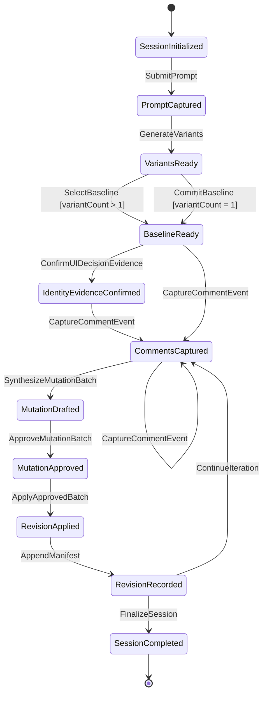
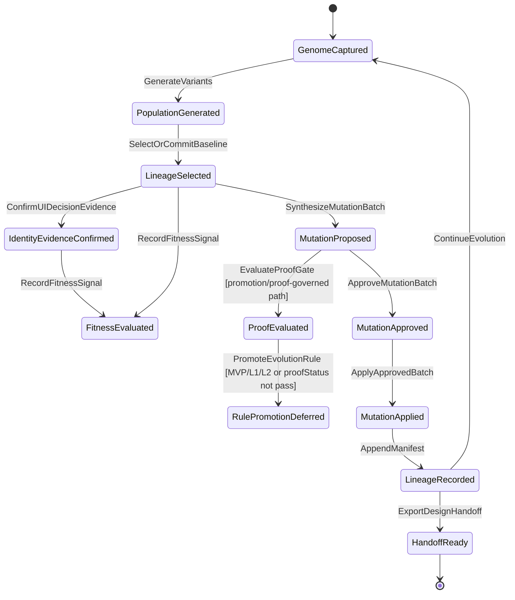

# State Machines: UI Prototyping Studio

## Capability Backlinks

- [Variant Generation and Baseline Gate](SPEC.md#variant-generation-and-baseline-gate)
- [Prototype Revision Loop](SPEC.md#prototype-revision-loop)
- [Manual Governance and Apply Control](SPEC.md#manual-governance-and-apply-control)
- [UI Identity and Visual DNA Taxonomy](SPEC.md#ui-identity-and-visual-dna-taxonomy)
- [Evolution Engine](SPEC.md#evolution-engine)
- [Proof and Self-Improvement Gate](SPEC.md#proof-and-self-improvement-gate)

## StudioSessionState

### Transition Table

| From                      | Event                     | To                        | Guard                                                     | Effect                                                                                                                                                                                                 |
| ------------------------- | ------------------------- | ------------------------- | --------------------------------------------------------- | ------------------------------------------------------------------------------------------------------------------------------------------------------------------------------------------------------ |
| SessionInitialized        | SubmitPrompt              | PromptCaptured            | Prompt is non-empty                                       | [StudioSession](domain.md#studiosession).prompt stored                                                                                                                                                 |
| PromptCaptured            | GenerateVariants          | VariantsReady             | [VariantCount](domain.md#variantcount).value in `{1,2,3}` | [PrototypeVariant](domain.md#prototypevariant) rows created                                                                                                                                            |
| VariantsReady             | SelectBaseline            | BaselineReady             | `variantCount > 1` and selected label is valid            | [BaselineProvenance](domain.md#baselineprovenance), [BaselineRevisionAnchor](domain.md#baselinerevisionanchor), and [BaselineGenealogyFamily](domain.md#baselinegenealogyfamily) created               |
| VariantsReady             | CommitBaseline            | BaselineReady             | `variantCount = 1`                                        | Single-option [BaselineProvenance](domain.md#baselineprovenance), [BaselineRevisionAnchor](domain.md#baselinerevisionanchor), and [BaselineGenealogyFamily](domain.md#baselinegenealogyfamily) created |
| BaselineReady             | ConfirmUIDecisionEvidence | IdentityEvidenceConfirmed | Human confirmation present                                | [UIElementIdentity](domain.md#uielementidentity), [UIVisualSignature](domain.md#uivisualsignature), and [UIDecisionRecord](domain.md#uidecisionrecord) become durable                                  |
| BaselineReady             | CaptureCommentEvent       | CommentsCaptured          | Comment payload passes schema                             | [CommentEvent](domain.md#commentevent) appended                                                                                                                                                        |
| IdentityEvidenceConfirmed | CaptureCommentEvent       | CommentsCaptured          | Comment payload passes schema                             | [CommentEvent](domain.md#commentevent) appended                                                                                                                                                        |
| CommentsCaptured          | CaptureCommentEvent       | CommentsCaptured          | Comment payload passes schema                             | Additional [CommentEvent](domain.md#commentevent) appended                                                                                                                                             |
| CommentsCaptured          | SynthesizeMutationBatch   | MutationDrafted           | Ordered comment set exists                                | [MutationBatch](domain.md#mutationbatch).status=`draft`                                                                                                                                                |
| MutationDrafted           | ApproveMutationBatch      | MutationApproved          | Explicit approval metadata present                        | [MutationBatch](domain.md#mutationbatch).status=`approved`; `applyGate='satisfied'`                                                                                                                    |
| MutationApproved          | ApplyApprovedBatch        | RevisionApplied           | Batch approved, non-stale, no auto-apply                  | Revision patch applied                                                                                                                                                                                 |
| RevisionApplied           | AppendManifest            | RevisionRecorded          | Manifest append succeeds                                  | [RevisionManifestEntry](domain.md#revisionmanifestentry) created; revision head updated                                                                                                                |
| RevisionRecorded          | ContinueIteration         | CommentsCaptured          | Session not finalized                                     | Loop continues on active baseline                                                                                                                                                                      |
| RevisionRecorded          | FinalizeSession           | SessionCompleted          | User finalizes session                                    | Session locked for handoff export                                                                                                                                                                      |

### Invariants

| ID  | Invariant                                                    | Formal                                                                                 |
| --- | ------------------------------------------------------------ | -------------------------------------------------------------------------------------- |
| I1  | Variant count remains bounded in all states                  | `[StudioSession](domain.md#studiosession).variantCount.value in {1,2,3}`               |
| I2  | Session default remains `3` when not explicitly overridden   | `requestedVariantCount=null -> variantCount=3`                                         |
| I3  | Multi-variant sessions cannot bypass explicit selection gate | `variantCount>1 -> selectionGate='satisfied' before MutationDrafted`                   |
| I4  | Single-variant sessions must use committed baseline mode     | `variantCount=1 -> baseline.mode='committed'`                                          |
| I5  | Apply transitions require approved batch only                | `state=MutationApproved -> [MutationBatch](domain.md#mutationbatch).status='approved'` |
| I6  | Auto-apply is forbidden in every state                       | `applyRequestedBy != 'system:auto'`                                                    |
| I7  | Every successful apply creates exactly one manifest entry    | `delta(count(RevisionManifestEntry)) = 1`                                              |
| I8  | Adapter compatibility remains runtime-independent            | `imports(newspaper.runtime)=0`                                                         |
| I9  | Normal MVP apply does not require proof-gate evaluation      | `ApplyApprovedBatch -> GovernanceGatePolicy only`                                      |

---

## EvolutionCycleState

### Transition Table

| From                      | Event                     | To                        | Guard                                                 | Effect                                                                                                                                                                                   |
| ------------------------- | ------------------------- | ------------------------- | ----------------------------------------------------- | ---------------------------------------------------------------------------------------------------------------------------------------------------------------------------------------- |
| GenomeCaptured            | GenerateVariants          | PopulationGenerated       | [VariantCount](domain.md#variantcount) valid          | Candidate population is created                                                                                                                                                          |
| PopulationGenerated       | SelectOrCommitBaseline    | LineageSelected           | Baseline gate satisfied                               | Winning lineage recorded as [BaselineGenealogyFamily](domain.md#baselinegenealogyfamily)                                                                                                 |
| LineageSelected           | ConfirmUIDecisionEvidence | IdentityEvidenceConfirmed | Baseline family exists and human confirmation present | [UIElementIdentity](domain.md#uielementidentity), [UIVisualSignature](domain.md#uivisualsignature), and [UIDecisionRecord](domain.md#uidecisionrecord) become durable genealogy evidence |
| LineageSelected           | RecordFitnessSignal       | FitnessEvaluated          | Fitness vector valid                                  | [FitnessSignal](domain.md#fitnesssignal) appended                                                                                                                                        |
| IdentityEvidenceConfirmed | RecordFitnessSignal       | FitnessEvaluated          | Fitness vector valid                                  | Optional identity-fit signal appended                                                                                                                                                    |
| LineageSelected           | SynthesizeMutationBatch   | MutationProposed          | Ordered comment set exists                            | [MutationBatch](domain.md#mutationbatch) proposed                                                                                                                                        |
| MutationProposed          | ApproveMutationBatch      | MutationApproved          | Manual approval present                               | Normal MVP apply gate can be satisfied                                                                                                                                                   |
| MutationProposed          | EvaluateProofGate         | ProofEvaluated            | Promotion or proof-governed path                      | [EvolutionCycle](domain.md#evolutioncycle).proofStatus updated                                                                                                                           |
| ProofEvaluated            | PromoteEvolutionRule      | RulePromotionDeferred     | MVP runtime or proof not passed                       | Self-improvement is recorded but not promoted                                                                                                                                            |
| MutationApproved          | ApplyApprovedBatch        | MutationApplied           | Batch approved, non-stale, no auto-apply              | Prototype mutation applied                                                                                                                                                               |
| MutationApplied           | AppendManifest            | LineageRecorded           | Manifest append succeeds                              | [RevisionManifestEntry](domain.md#revisionmanifestentry) preserves lineage                                                                                                               |
| LineageRecorded           | ContinueEvolution         | GenomeCaptured            | User continues iteration                              | New genome includes prior comments, tasks, fitness signals, and revision evidence                                                                                                        |
| LineageRecorded           | ExportDesignHandoff       | HandoffReady              | Handoff references complete                           | Downstream handoff bundle ready                                                                                                                                                          |

### Invariants

| ID  | Invariant                                                               | Formal                                                                                         |
| --- | ----------------------------------------------------------------------- | ---------------------------------------------------------------------------------------------- |
| EC1 | A population cannot exceed the session variant bound                    | `count(populationVariantLabels) = StudioSession.variantCount.value`                            |
| EC2 | A lineage cannot be selected before fitness or explicit baseline        | `LineageSelected -> selectionGate='satisfied'`                                                 |
| EC3 | Mutation ancestry must derive from selected lineage family              | `MutationBatch.sourceRevisionId = BaselineGenealogyFamily.baselineRevisionId`                  |
| EC4 | Rule promotion requires proof pass and non-auto actor                   | `RulePromoted -> proofStatus='pass' and promotedBy!='system:auto'`                             |
| EC5 | MVP runtime cannot promote evolution rules directly                     | `runtimeMvp -> RulePromotionDeferred`                                                          |
| EC6 | Revision lineage remains append-only                                    | `LineageRecorded -> appendCount(RevisionManifestEntry)=1`                                      |
| EC7 | Durable UI identity and visual DNA evidence requires human confirmation | `exists(UIElementIdentity, UIVisualSignature, UIDecisionRecord) -> confirmedBy!='system:auto'` |
| EC8 | Proof gates do not govern normal MVP apply by default                   | `ApplyApprovedBatch -> not required(EvaluateProofGate)`                                        |
