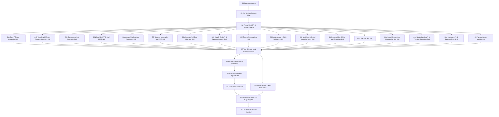

# Security Agent Research Strategy

## Purpose

Design a governed research-and-development program for a ResonantOS security agent that can:

- map every meaningful attack surface and attack vector in the app;
- generate a security architecture view of the current system;
- split red-team work into specialized, reusable skills;
- select existing tools before inventing local checks;
- measure security maturity, identify gaps, and create deterministic tests;
- feed validated checks into the existing registry-driven security pipeline.

This is a strategy artifact, not permission to run invasive tests. Any active exploitation, destructive probing, broad network scanning, credential attack, or persistence simulation must pass an explicit approval gate first.

## Starting Evidence

Existing starting points:

- The first `security-reviewer` run identifies real surfaces across Tauri IPC, webview/CSP, capability gates, provider HTTP requests, local subnet discovery, subprocess delegation, addon manifests, browser automation, Telegram, Paperclip, archive storage, local files, logs, and supply chain.
- The `threat-model-profiler` run adds entry-point and topology evidence for browser-first bridge routes, side-panel extension communication, Electron IPC mode, local listener bind behavior, bridge/capability tokens, memory-service host overrides, terminal shell execution, native library loading, hardcoded LAN endpoints, unsigned artifacts, and the missing `SECURITY.md` disclosure surface.
- The existing security pipeline MVP already defines a registry-driven check control plane in `.github/security-pipeline/checks.yml`.
- The MVP has completed `SWU-SP-001` through `SWU-SP-003`; `SWU-SP-004` is blocked in this shell by missing `npm`.

The new security agent should not replace that pipeline. It should sit above it as a research, design, red-team simulation, and maturity-scoring system that emits checks and evidence into the pipeline.

## Threat Model Profiler Delta

The profiler evidence is already partially covered by the existing security strategy, but it adds these explicit lanes:

| Profiler finding | Current status in this strategy |
| --- | --- |
| `SECURITY.md` absent | Added to `security-disclosure-release-trust`. |
| Browser-first bridge routes and capability-token split | Added to `security-browser-first-bridge-extension`. |
| Side-panel extension reads page content and talks to bridge | Added to browser-first/extension trust boundary. |
| Electron IPC mirrors command surface | Added to `security-electron-ipc-boundary`. |
| Memory service host can be overridden to `0.0.0.0` | Added to `security-local-listener-topology`. |
| Hardcoded LAN endpoint `192.168.1.77:30004` | Covered by provider-network and local-listener lanes. |
| Terminal add-on intentionally runs `sh -lc` / `cmd /C` | Added to `security-native-loading-terminal`. |
| `RESONANTOS_NATIVE_BROWSER_BRIDGE` can influence `Library::new` | Added to native-loading lane. |
| Full host env forwarded to Hermes/OpenCode | Covered by subprocess/toolchain and secrets/data lifecycle lanes. |
| Prompt content passed in process argv | Added to subprocess/toolchain lane. |
| Unsigned release artifacts / no code signing | Added to disclosure/release-trust lane. |
| No bridge/server rate limiting | Added to local-listener topology lane. |
| Electron screenshot temp cleanup | Covered by file/data lifecycle lane. |

## Strategy Shape

Use a DAG, not a single linear audit.

The work has dependencies:

1. Asset and architecture mapping must happen before threat modeling.
2. Threat modeling must happen before selecting red-team simulations.
3. Safe static and unit-level tests can run before active dynamic tests.
4. Active tests require authorization and scoped fixtures.
5. Maturity scoring depends on evidence from mapping, tooling, test results, and remediation decisions.

The DAG approach has merit because each surface can be researched independently while still joining through a common evidence contract. It also prevents the agent from jumping directly from a finding to an exploit without architecture context, owner boundary, and approval.

## Stage DAG



## Security Architecture Output

The research must produce a security architecture artifact with at least these views:

| View | Required content |
| --- | --- |
| Asset map | User data, provider secrets, Telegram token, app state, addon manifests, browser profiles, archive DB, logs, packaged artifacts, installed agent skills, bridge tokens, capability tokens, extension config, Hermes/OpenCode profiles |
| Trust boundaries | Tauri webview to Rust IPC, Electron renderer to main IPC, Chrome/Firefox extension to bridge server, addon capability checks, subprocess boundary, provider network boundary, browser/CDP boundary, local filesystem boundary |
| Data flows | Secret write/read, provider request, archive ingest, browser session lifecycle, addon sideload, Telegram polling, Paperclip API calls, bridge route requests, memory service requests, prompt handoff to Hermes/OpenCode, generated extension token config |
| Control map | CSP, Tauri capabilities, Electron context isolation/sandbox, bridge bearer token, bridge capability tokens, CORS extension origin, command gates, path containment, lockfiles, audits, redaction, local bind addresses |
| Attack tree | Per-surface preconditions, vectors, exploit paths, current controls, missing controls, safe tests |
| Maturity matrix | Surface maturity score, evidence, gaps, next check, promotion target |
| Agentic attack map | Malicious skill instructions, suspicious scripts, network exfiltration, credential/key access, memory poisoning, tool misuse, worm-like propagation, developer extension analogues |

## Surface And Skill Families

| Skill family | Surface | Vector focus | Candidate outputs |
| --- | --- | --- | --- |
| `security-tauri-ipc-boundary` | `#[tauri::command]`, capability gates | Ungated command invocation, payload size abuse, privilege escalation through state writes | command inventory, gate coverage test, IPC fuzz fixtures |
| `security-webview-csp-injection` | React/Vite webview and CSP | XSS, unsafe HTML rendering, CSP bypass, frontend-to-IPC escalation | CSP policy proposal, sanitizer tests, DOM sink Semgrep rules |
| `security-subprocess-toolchain` | `Command::new`, Node/Rust scripts, opencode, Hermes/OpenCode process launch | Command injection, unsafe env propagation, binary resolution hijack, prompt leakage through process argv | command sink map, PATH hardening checks, subprocess regression tests, env-scope tests |
| `security-provider-network` | `reqwest`, provider discovery, local subnet scan | SSRF, internal host probing, quota abuse, provider request leakage | URL allowlist strategy, subnet consent tests, provider budget checks |
| `security-addon-filesystem` | addon manifests, audio import, archive/obsidian paths | Path traversal, manifest id traversal, broad filesystem writes | manifest id validator tests, path containment fixtures |
| `security-browser-automation` | Chromium sessions, CDP, native browser FFI | exposed loopback devtools, session id predictability, profile residue, unsafe FFI review | CDP exposure analysis, session id tests, orphan cleanup checks |
| `security-secrets-data-lifecycle` | provider secrets, Telegram token, logs, archive data | plaintext secrets, weak permissions, log leakage, retention gaps | vault gap report, permission tests, retention policy checks |
| `security-supply-chain-release` | npm, Cargo, GitHub Actions, packaging | vulnerable deps, unpinned actions, provenance gaps, SBOM absence | npm/cargo/OSV adapters, action hardening, SBOM/provenance plan |
| `security-external-integrations` | Telegram, Paperclip, provider APIs, Living Archive MCP | token overwrite, polling abuse, third-party data exposure | integration threat model, token gate tests, external API evidence map |
| `security-agent-skill-runtime-validation` | `.agents/skills`, `.codex/skills`, `.claude/skills`, `.github/skills`, `tools/arcanum` | stale installs, missing schema/catalog/script dependencies, malformed frontmatter, command resolution drift, permission metadata gaps | installed skill inventory, frontmatter/schema validator, command resolution smoke, missing-support-file report |
| `security-agent-skill-malware-analysis` | installed skills, agents, hooks, scripts, generated commands, MCP/tool configs | malicious instructions, unexpected shell/network/file access, secret reads, user-data exfiltration, persistence, obfuscation, privilege mismatch | suspicious behavior ledger, permission-to-purpose matrix, network/shell call inventory, denylist and allowlist rules |
| `security-agentic-attack-intelligence` | agent workflows, memory, tools, skills, retrieved content, developer extension analogues | prompt-injection worms, memory poisoning, goal hijack, excessive agency, tool abuse, approval bypass, multi-agent cascading failures | attack taxonomy, abuse-case matrix, adversarial prompt fixtures, prevention checklist |
| `security-browser-first-bridge-extension` | `browser-first` bridge server, side-panel extension, generated bridge config | route authorization gaps, bridge token exposure, capability-token scope drift, CORS origin assumptions, page-content ingestion, extension supply chain | bridge route matrix, capability-token coverage test, extension trust-boundary map |
| `security-electron-ipc-boundary` | `electron-host` renderer-to-main IPC, static/provider/wallet servers | mirrored command surface without per-command auth, sandbox posture, preload boundary bypass, local server exposure | Electron IPC inventory, contextIsolation/sandbox posture test, command parity matrix |
| `security-local-listener-topology` | Vite, bridge server, memory service, Hermes dashboard, Electron local servers, CDP | loopback assumptions, `0.0.0.0` env overrides, no TLS, no rate limiting, local process access to tokens/ports | listener inventory, bind-host guard tests, route rate-limit gap report |
| `security-native-loading-terminal` | terminal addon, PTY, `sh -lc`, `cmd /C`, `libloading`, native browser bridge env var | intended shell execution blast radius, arbitrary native library load, PATH hijack, argv prompt leakage | shell/native execution threat model, env-var library-load tests, PATH pinning recommendations |
| `security-disclosure-release-trust` | `SECURITY.md`, GitHub Actions artifacts, signing/notarization, dependency disclosure | missing vulnerability disclosure path, unsigned artifacts, code-signing gaps, security release process absence | disclosure policy draft, artifact trust matrix, signing/provenance roadmap |

Each skill should have:

- scope and explicit out-of-scope boundaries;
- input discovery commands;
- safe default tests;
- red-team simulation tests requiring approval;
- tool requirements and installation assumptions;
- evidence schema;
- maturity criteria;
- promotion path into `.github/security-pipeline/checks.yml`.

For skill and agent validation, the evidence must also include:

- scripts and hooks invoked by the skill or agent;
- network-capable commands such as `curl`, `wget`, `fetch`, `Invoke-WebRequest`, `reqwest`, `axios`, `netcat`, and webhook clients;
- secret and user-data access patterns, including `.env`, SSH keys, cloud credentials, browser profiles, wallet paths, token files, and `.resonantos/`;
- persistence or propagation patterns, including writing to memory files, startup folders, hooks, shell profiles, IDE extension directories, or generated command surfaces;
- tool-call justification: every requested tool or permission must match the skill's stated purpose.

## Tool Research Baseline

Use established tools before writing custom adapters:

| Area | Tool candidates | Why they fit |
| --- | --- | --- |
| Standards and criteria | OWASP ASVS 5.0.0, OWASP SAMM | ASVS gives technical verification requirements; SAMM gives program maturity structure. |
| Tauri security | Tauri security docs, capabilities, CSP, IPC trust boundaries | ResonantOS is a Tauri desktop app, so webview-to-core boundaries are first-class. |
| Agentic skill security | OWASP Agentic Skills Top 10, OWASP Agentic AI threats, OWASP AI Agent Security Cheat Sheet | Treats skills as a behavior/execution layer with risks around file, network, shell, memory, and tool orchestration. |
| Static analysis | CodeQL, Semgrep | CodeQL fits GitHub code scanning; Semgrep supports TypeScript, JavaScript, Rust, YAML, and custom rules. |
| Dependency vulnerabilities | npm audit, OSV-Scanner, cargo-audit, GitHub dependency review | Covers npm and Cargo lockfiles plus PR dependency deltas. |
| Secrets | Gitleaks, TruffleHog, GitHub secret scanning where available | Finds committed credentials and can be wired into CI. |
| Supply-chain posture | OpenSSF Scorecard, action pinning checks, SLSA/provenance research | Measures repo hygiene and release integrity gaps. |
| Dynamic web/API probing | OWASP ZAP Automation Framework, Nuclei | Useful only against scoped local/staging targets; active scans require authorization. |
| SBOM and image/package checks | Syft, Grype, OSV-Scanner | Useful once release artifacts and packaged app boundaries are stable. |
| Developer-extension analogues | VS Code Workspace Trust, extension manifest/activation events, extension runtime security docs | Agent skills resemble IDE extensions: they can be installed from untrusted sources and can execute code or access workspace data. |

Reference sources checked:

- OWASP ASVS: https://owasp.org/www-project-application-security-verification-standard/
- OWASP SAMM: https://owasp.org/www-project-samm/
- OWASP Agentic Skills Top 10: https://owasp.org/www-project-agentic-skills-top-10/
- OWASP Agentic AI Threats and Mitigations: https://genai.owasp.org/resource/agentic-ai-threats-and-mitigations/
- OWASP AI Agent Security Cheat Sheet: https://cheatsheetseries.owasp.org/cheatsheets/AI_Agent_Security_Cheat_Sheet.html
- OWASP Top 10 for LLM Applications: https://owasp.org/www-project-top-10-for-large-language-model-applications/
- Tauri security model: https://v2.tauri.app/security/
- VS Code Workspace Trust: https://code.visualstudio.com/docs/editing/workspaces/workspace-trust
- VS Code extension runtime security: https://code.visualstudio.com/docs/configure/extensions/extension-runtime-security
- VS Code activation events: https://code.visualstudio.com/api/references/activation-events
- GitHub CodeQL/code scanning: https://docs.github.com/en/code-security/concepts/code-scanning/about-code-scanning
- GitHub dependency review: https://docs.github.com/en/code-security/concepts/supply-chain-security/about-dependency-review
- Semgrep docs: https://semgrep.dev/docs/
- OSV-Scanner docs: https://google.github.io/osv-scanner/
- cargo-audit: https://github.com/rustsec/rustsec/tree/main/cargo-audit
- Gitleaks: https://github.com/gitleaks/gitleaks
- OWASP ZAP Automation Framework: https://www.zaproxy.org/docs/automate/automation-framework/
- Nuclei docs: https://docs.projectdiscovery.io/opensource/nuclei/overview
- OpenSSF Scorecard: https://github.com/ossf/scorecard

## Maturity Model

Score each surface at one of five levels:

| Level | Name | Meaning |
| --- | --- | --- |
| 0 | Unknown | Surface exists but is not mapped or tested. |
| 1 | Mapped | Assets, flows, boundaries, and obvious vectors are documented. |
| 2 | Guarded | Current controls are documented and at least one deterministic test exists. |
| 3 | Stress-tested | Safe red-team simulations or fuzz/property tests exercise likely abuse paths. |
| 4 | Managed | Checks are in CI or a repeatable local harness with evidence, owners, and remediation lifecycle. |

The initial target is level 2 for every surface, level 3 for the highest-risk surfaces, and level 4 for supply chain plus any fix that becomes a regression risk.

Installed agent skills have a stricter readiness rule: a skill cannot be used as a security-control primitive until it reaches level 2. That means it is installed, discoverable, structurally valid, has required support files, and its command or resolver path can be smoke-tested.

Agent skills and agents also require a hostile-content rule: a skill cannot reach level 2 if it contains unexplained network egress, shell execution, secret reads, memory mutation, persistence, or broad filesystem access that is not justified by its purpose and approved by the operator.

## Red-Team Test Policy

Default allowed without additional approval:

- static scans;
- unit tests and fixtures;
- offline malicious-content review of skills, agents, scripts, hooks, and command files;
- permission-to-purpose review for tool calls and runtime permissions;
- network/shell/secret-access inventory without executing those operations;
- local path traversal fixtures inside temporary directories;
- IPC payload tests against mocked or test-only commands;
- dependency and secret scans;
- architecture and threat-model research.

Requires explicit approval:

- active scanner runs such as ZAP activeScan or broad Nuclei templates;
- executing suspicious skill scripts or hooks;
- live network egress tests from installed skills or agents;
- local subnet probing beyond existing code inspection;
- exploit chains that write outside a temp directory;
- credential overwrite/delete simulations against real app state;
- browser/CDP takeover demonstrations against live user profiles;
- tests that call paid external provider APIs or Telegram/Paperclip endpoints.

Always blocked unless separately authorized in a dedicated task:

- persistence, malware-like behavior, exfiltration, destructive deletion, self-replication, or attacks against third-party systems.

## Promotion Path

Research outputs should flow into implementation through this sequence:

1. Create or update a skill design for one surface family.
2. When any finding requires development, do not implement directly from the research note. Create an invoke handoff route using the exact transition sentence: `$invoke handoff use context builder to prepare development for <finding-or-surface>`.
3. The handoff must use `context-builder` to gather the smallest sufficient repository evidence, target files, constraints, validation commands, and risk boundaries for that specific development item.
4. Generate safe tests and fixtures for that family only after the handoff defines the implementation boundary.
5. If useful, add a check adapter to `scripts/security-pipeline/checks/`.
6. Add a registry entry to `.github/security-pipeline/checks.yml` with `observe` or `warn` first.
7. Promote to `block` only after deterministic validation and low false-positive risk.
8. Record maturity score changes and remaining gaps.

Development trigger rule:

```text
$invoke handoff use context builder to prepare development for <finding-or-surface>
```

Use this whenever a mapped gap, failing maturity criterion, missing control, unsafe default, vulnerable dependency, malicious-skill signal, or red-team test idea becomes an implementation candidate.

## First Recommended Work Slice

Start with `security-tauri-ipc-boundary`.

Reason:

- The first reviewer report identified multiple ungated commands and the null CSP makes webview-to-IPC escalation a central risk.
- It can be tested safely with static inventory and deterministic unit-like checks.
- It produces reusable patterns for later skills: surface inventory, control coverage, fixture attacks, and maturity scoring.

The second slice should be `security-webview-csp-injection`, because CSP and DOM sinks determine how hard it is for an attacker to reach IPC commands.

The third slice should be `security-addon-filesystem`, because addon manifest id traversal and broad filesystem writes are concrete, high-signal vectors with deterministic tests.

Before creating new generated security skills, run `security-agent-skill-runtime-validation` once against the current install. The dispatch-spec validator already exposed one example gap: the repo-local dispatch validator exists, but its default schema/catalog lookup points at `.agents/formulae/dispatch-spec/`, which is not present after the install. That class of gap should be caught by the installed-skill validation stage.
